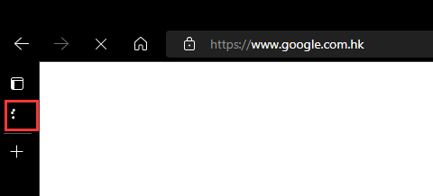
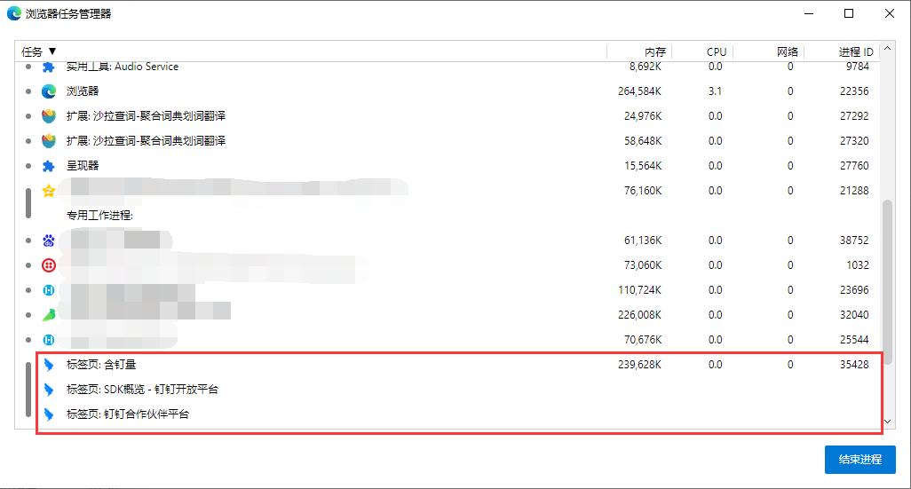
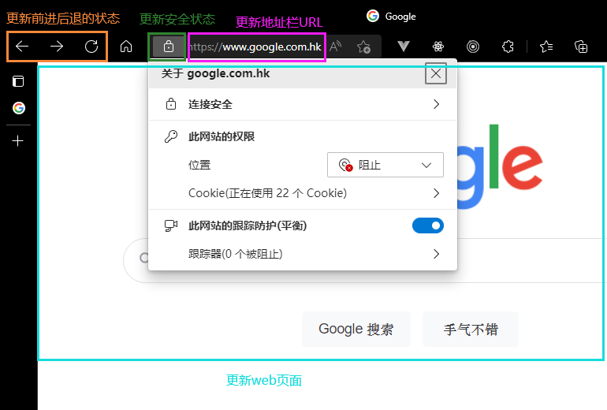

# Web 一看就会一做就废（一）输入 URL 后的那些事


**浏览器**，这个现代人陌生又熟悉的电脑工具，使用它的大多数不会想去了解浏览器背后的“故事”，但要作为一名“合格”的前端人员，就必须要刨根问底~

那么在浏览器里，从用户输入 URL 敲下回车的那一刻起，这中间发生了什么？我们一步一步来探索。


## 1.用户输入

当用户打开浏览器，在上方地址栏中输入一段字符后，地址栏会判断用户输入的关键字是**搜索内容**，还是**请求的 URL**。

- 如果是搜索内容，地址栏会使用浏览器默认的搜索引擎，来合成新的带搜索关键字的 URL。
- 如果判断输入内容符合 URL 规则，比如输入的是 `www.google.com` ，那么地址栏会根据，把这段内容加上对应的协议`(http / https / ftp...)`，合成为完整的 URL，如`https://www.google.com`。

当用户输入关键字并键入回车之后，这意味着当前页面要被替换为成新的页面，不过在这个流程继续之前，浏览器还给了当前页面一次执行[beforeunload]([Window: beforeunload event - Web APIs | MDN (mozilla.org)](https://developer.mozilla.org/en-US/docs/Web/API/Window/beforeunload_event))事件，该事件允许页面在退出之前执行一些数据清理操作，还可以询问用户是否要离开当前页面。

比如当前页面没有监听`beforeunload`事件或者同意了继续后续流程，那么浏览器便进入下图的状态：

从图中可以看出，当浏览器开始加载用户输入的地址后，标签页上的图标便开始进入加载状态。但此时图中页面显示的依然是之前打开的页面内容，并没有立即替换为 google 的页面。因为浏览器需要等待提交文档阶段，页面内容才会被替换。

## 2.URL 请求过程

接下来，浏览器进入了页面资源请求过程。这时，浏览器进程会通过进程间通信`(IPC, Inter-Process Communication)`把 URL 请求发送至网络进程，网络进程收到 URL 请求后，会在这里发起真正的 URL 请求流程。

具体流程：

首先，网络进程会查找本地缓存是否缓存了该资源。如果发现浏览器有缓存资源，那么直接返回资源给浏览器进程；如果在缓存中没有查找到资源，那么直接进入网络请求流程。发送请求的第一步是要进行`DNS`解析，以获取请求域名的服务器 IP 地址。如果请求协议是`HTTPs`，那么还需要建立`TLS`连接，当然建立`TLS`连接前先进行`TCP`连接。

> Chrome 有一个机制，同一个域名下同时最多只能建立 6 个 TCP 连接，如果在同一个域名下有 10 个请求发生，那么其中 4 个请求会进入排队等待状态，直至进行中的请求完成；如果当前请求数量少于 6 个，会直接建立 TCP 连接。

接下来利用 IP 地址和服务器建立`TCP`连接。连接建立之后，浏览器端会构建请求行、请求头、请求体等信息，并把和该域名相关的`Cookie`等数据附加到请求头中，然后向服务器发送构建的请求信息。

> 注意，如果有跨域`(CORS)`情况，浏览器会检查是否遵循同源策略，同端口、同协议、同域名，如果不符合则直接会抛出错误。

服务器接收到请求信息后，会根据请求信息生成响应数据（包括响应行、响应头和响应体等信息），并发送给网络进行。等网络进程接收了响应行和响应头之后，就开始解析响应头的内容了。

> 为了方便描述，以下服务器返回的响应头和响应行统称为响应头。

（1）重定向

在接收到服务器返回的响应头后，网络进程开始解析响应头，如果发现返回的状态码是`301`或`302`，那么说明服务器需要浏览器重定向到其他的 URL。这时网络进程会从响应头的`Location`字段里面读取重定向的地址，然后再次发起新的`HTTP`或`HTTPs`请求，一切又重新再来一遍~！

例如，我们在命令行里输入以下命令：

```bash
curl -I http://www.xxx.com
```

会看到服务器返回如下信息：



从上图可以看出，服务器会通过重定向的方式把所有`HTTP`请求转换为`HTTPs`请求。也就是说你使用`HTTP`向网站服务器请求时，服务器会返回一个包含有`301`或`302`状态码响应头，并把响应头的`Location`字段中填上`HTTPs`的地址，这就是告诉浏览器要重新请求并导航到新的地址上。

下面我们再使用`HTTPs`协议对 google 发起请求，看看服务器的响应头信息是什么样子。



从图中可以看出，服务器返回的响应头的状态码是`200`，这是告诉浏览器 everything is OK！可以继续接下来的工作了。

总结一下，在导航过程中，如果服务器响应行的状态码包含了`301`、`302`一类的跳转信息，浏览器就会跳转到新的地址继续导航；如果响应行是`200`，那么表示浏览器可以继续处理该请求。

### 常见的状态码

| code | 解释                                                            |
| ---- | --------------------------------------------------------------- |
| 200  | OK，说明使用 GET/HEAD/PUT/POST/TRACE 方法请求成功               |
| 204  | No Content，请求没有要发送的内容                                |
| 301  | Moved Permanently，URL 请求的资源已经永久性替换                 |
| 302  | Found，服务器返回相应需要重新从另一个 URI 使用 GET 方法获取资源 |
| 304  | Not Modified，告诉客户端响应无变更，可以使用缓存                |
| 403  | Forbidden，客户端未授权无权访问，服务器拒绝请求访问对应的资源   |
| 404  | Not Found，服务器没有找到请求所需要的资源                       |
| 500  | Internal Server Error，服务器有问题无法处理请求                 |
| 502  | Bad Gateway，无效的响应                                         |

（2）相应数据类型处理

在处理了跳转信息之后，我们继续导航流程的梳理。URL 请求的数据类型，有时候是一个下载类型，有时候是正常的 HTML 页面，那么浏览器是如何区分它们的呢？

答案：`Content-Type`。`Content-Type`是`HTTP`头中一个非常重要的字段，它告诉浏览器服务器返回的响应体数据是什么类型的，然后浏览器会根据`Content-Type`的值来决定如何显示响应体的内容。

我们分别输入下面的命令：

```bash
curl -I https:www.baidu.com
curl -I https://www.7-zip.org/a/7z2201-x64.exe
```



从图中可以看到，响应头中`Content-Type`字段的值分别为 `text/html` 和 `application/octet-stream`，对应的分别表示从服务器返回的数据是**HTML 格式**的数据和**字节流类型**的数据。通常情况下，如果返回的是字节流类型的数据，浏览器会按照下载类型来处理该请求。

需要注意的是，如果服务器配置`Content-Type`不正确，将`text/html`类型配置成`application/octet-stream`类型，那么浏览器可能会曲解文件内容，比如会将一个本来是用来展示的页面，变成了一个下载文件。

所以，不同`Content-Type`的后续处理流程也截然不同。如果`Content-Type`字段的值被浏览器判断为下载类型，那么该请求会被提交给**浏览器的下载管理器**，同时该 URL 请求的导航流程就此结束。但如果是`HTML`，那么浏览器则会**继续进行导航流程**。

由于 Chorme 的页面渲染是进行在渲染进程中的，所以接下来就需要准备渲染流程了。

## 3.准备渲染进程

默认情况下，Chrome 会为每一个页面分配一个渲染进程，也就是说，每打开一个新 tab 页面就会配套创建一个新的渲染进程。但是，这也有例外，在某些情况下，浏览器会让多个页面直接运行在同一个渲染进程中。

比如，我从钉钉开放平台的首页打开了另外两个页面——《钉钉合作伙伴平台》和《SDK 概览》。打开浏览器任务管理器，可以看到：



打开的这三个页面都是运行在同一个渲染进程中，进程 ID 是`35428`。

那在什么情况下多个页面才会同时运行在一个渲染进程中呢？

要解决这个问题，我们就需要先了解一下什么是**同一站点**`(same-site)`。具体来说，同一站点定义为**根域名**（例如 dingtalk.com）+**协议**（例如 https://或 http://）+**该根域名下的所有子域名和不同的端口号。**

```
https://open.dingtalk.com/integration
https://partner.dingtalk.com/
https://open.dingtalk.com/document/hardware-access/sdk-overview
```

它们都是属于同一站点，因为他们的协议都是`HTTPs`，并且根域名也都是`dingtalk.com`。

Chrome 和 Edge 的默认策略是，每个标签对应一个渲染进程。但如果从一个页面打开了另一个页面，并且新页面和当前页面属于同一站点的话，那么新页面会复用父页面的渲染进程。官方把这个默认策略叫`process-per-site-instance`。

如果新页面和当前页面不属于同一站点，那么浏览器就会创建一个渲染进程针对新页面进行渲染。

总结一下，打开一个新页面采用的渲染进程策略就是：

- 通常情况下，打开新的页面都会使用单独的渲染进程；
- 如果从 A 页面打开 B 页面，且 A 和 B 都属于同一站点的话，那么 B 页面复用 A 页面的渲染进程；如果是其他情况，浏览器进程则会为 B 创建一个新的渲染进程。

渲染进程准备好之后，还不能立即进入文档解析状态，因为此时的文档数据还在网络进程中，并没有提交给渲染进程，所以下一步就进入了提交文档阶段。

## 4.提交文档

提交文档，指的是浏览器进程将网络进程接收到的 HTML 数据提交给渲染进程，具体流程如下：

- 首先到浏览器进程接收到网络进程的响应头数据之后，便向渲染进程发起“提交文档”的信息；
- 渲染进程接收到“提交文档”的消息后，会和网络进程建立传输数据的“管道”；
- 等待文档数据传输完成之后，渲染进程会返回“确认提交”的消息给浏览器进程；
- 浏览器进程在收到“确认提交”的消息后，会更新浏览器界面状态，包括了**安全状态、地址栏的 URL、前进后退的历史状态**，并更新 web 页面。

其中，当渲染进程确认提交之后，更新内容如下图：



这样就解释了为什么在浏览器的地址栏里输入了一个地址后，之前的页面没有立马消失被替换，而是要加载一会儿才更新页面。

到此，一个完整的导航流程就结束了，接下来就是要进入渲染阶段了。

## 5.渲染阶段

一旦文档被提交，渲染进程便开始页面解析和子资源加载了，页面生成完成后，渲染进程会发送一个消息给浏览器进程，浏览器收到消息后，会停止标签图表上的加载动画。

新的页面也就会展现在我们的面前~
