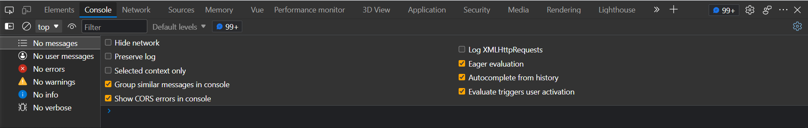
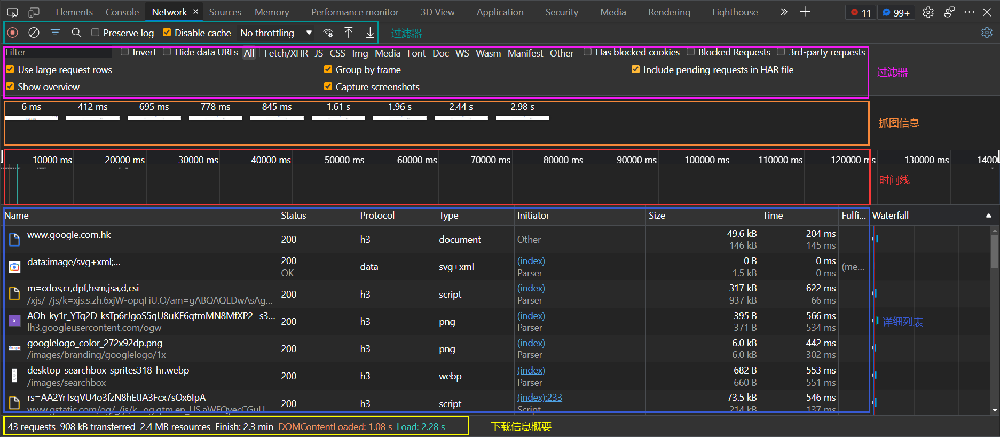
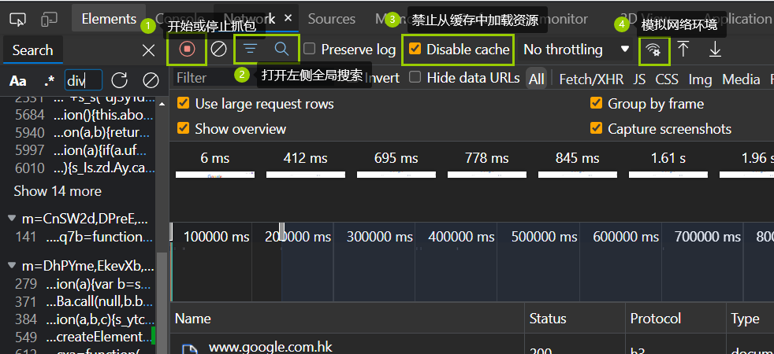
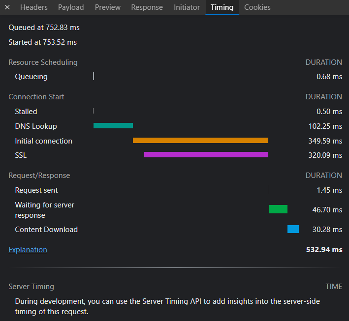

# Web Performance--浏览器开发者工具（一）

Chrome 开发者工具`(DevTools)`，这个词儿听上去就是未开发人员准备的。没错，浏览器的开发工具可以让开发人员快速分析诊断网页错误及性能，帮助开发人员构建更快、更好的网页应用。Chrome 开发者工具非常重要，所蕴含的内容也是非常的多，熟练使用它能让我们更加深入地了解浏览器内部工作原理。

## Chrome 开发者工具

Chrome 开发者工具有很多重要的面板，比如与性能相关的有 Network 面板、Performance 面板、Memory 面板等等，与调试页面相关的有 Elements 面、Source 面板、Console 面板等等。

可以在浏览器窗口中按 F12 快捷打开 Chrome 开发者工具，如下图：

从上图中可以看出，有很多功能面板，可以参考下面表格对每一个面板的大致介绍：

| 名称        | 描述                                                                                                                                                                              |
| ----------- | --------------------------------------------------------------------------------------------------------------------------------------------------------------------------------- |
| Elements    | 可以查看 DOM 结构、编辑 CSS 样式，用于测试页面布局和设计页面。                                                                                                                    |
| Console     | 可以看作是 JavaScript Shell，可以执行 JavaScript 脚本。通过 Console 还能和页面中的 JavaScript 对象交互。                                                                          |
| Sources     | 查看 Web 应用加载的所有文件；编辑 CSS 和 JavaScript 文件内容；将打乱的 CSS 文件或 JavaScript 文件格式化；支持 JavaScript 的调试功能；设置工作区，将更改的文件保存到本地文件夹中。 |
| Network     | 展示了页面中所有的请求内容列表，能查看每项请求的请求行、请求头、请求体、时间线以及网络请求瀑布图等信息。                                                                          |
| Performance | 记录和查看 Web 应用生命周期内的各种事件，并用来分析在执行过程中一些影响性能的要点。                                                                                               |
| Memory      | 用来查看运行过程中的 JavaScript 占用堆内存情况，追踪是否存在内存泄露的情况等。                                                                                                    |
| Application | 查看 Web 应用的数据存储情况；PWA 的基础数据：IndexedDB；Web SQL；本地和会话存储 Cookie；应用程序缓存；图像；字体和样式表等。                                                      |
| Security    | 显示当前页面一些基础的安全信息。                                                                                                                                                  |
| Lighthouse  | 会对当前网页进行网络利用情况、网页性能方面的诊断，并给出一些优化建议。                                                                                                            |
| Layers      | 展示一些渲染过程中分层的基础信息。                                                                                                                                                |

我们继续重点关注 Network 面板，即网络面板。

## 网络面板

网络面板总体来说由控制器、过滤器、抓图信息、时间线、详细列表和下载信息概要这 6 个区域构成，我们来逐一看下。

### 1.控制器

其中控制器有 4 个比较重要的功能。

- 红色按钮，表示“开始/停止”抓包，可以控制查看下方请求的时间段；
- 全局搜索按钮，可以在所有下载资源中搜索相关内容，也可以快速定位想要的文件；
- Disable cache，在调试 Web 应用的时候非常有用，因为如果开启了 cache，就会影响网络性能测试的结果；
- Online 按钮，模拟各种网络情况，如 Fast 3G，Slow 3G 等等，可以限制带宽用于调整策略以便让 Web 应用更加适用于不同的网络带宽。

### 2.过滤器

过滤器很好理解，就是用于过滤功能。因为有时一个页面会加载非常多的内容，而我们只想查看某类文件，这时候就可以过滤器过滤掉无用的文件。

### 3.抓图信息

抓图信息区域，可以用来分析用户等待页面加载时间内所看到的内容，分析用户实际的体验情况。比如，如果页面加载 1 秒多之后屏幕截图还是白屏状态，这时就需要分析是网络问题还是代码问题了。

### 4.时间线

时间线，主要用来展示 HTTP、HTTPs、WebSocket 加载的状态和时间的一个关系，用于直观感受页面的加载过程。如果是多条竖线堆叠在一起，那说明这些资源被同时加载。至于具体到每个文件的加载信息，还需要用到详细列表具体分析。

### 5.详细列表

这个区域可谓是性能分析的主战场，它详细记录了每个资源从发起请求到完成请求这中间所有过程的状态，以及最终请求完成的数据信息。通过该列表，就可以发现诊断出一些存在的网络问题。

6.下载信息概要

这部分我们需要重点关注的是 `DOMContentLoaded` 和 `Load` 两个事件，以及这两个事件的完成时间。

- DOMContentLoaded，这个事件发生后，说明**页面已经构建好了 DOM**，这意味着构建 DOM 所需要的 HTML 文件、JavaScript 文件、CSS 文件都已经下载传输完成了。
- Load，说明浏览器已经加载了页面所有的资源（包括图像、样式等等）。

所以通过下载信息概要面板，我们可以查看触发这两个事件所花费的时间。

## 网络面板主战场--详细列表

### 1.列表的属性

列表中的属性比较多，包括 Name、Status、Protocol、Type、Initiator、Size、Time、Fulfilled by、Waterfall 等等，如果需要其他属性可以右键进行添加即可。

### 2.详细信息

如果选择详细信息列表中的一项请求，那么右边就会出现该项的详细系信息，可以查看请求列表中任意一项的请求行和请求头信息，还可以查看响应行、响应头和响应体。然后可以根据这些查看的信息来判断业务逻辑是否正确，或者有时也可以**用来逆向推导别人网站的业务逻辑。**

### 3.单个资源的时间线

详细信息了解之后，我们再来看单独的资源请求时间线，这就设计具体的 HTTP 请求流程了。

要看详细列表中如何表示整个流程，需要重点来看下时间线面板。

我们来解释下每一项的含义。

#### （1）Queuing

字面是排队的意思，当浏览器发起一个请求时，会有很多原因导致该请求**不能立刻马上被执行**，而是需要排队等待。而这个排队原因有很多：

- 页面资源有优先级，比如 CSS、HTML、JavaScript 等都是页面中的核心文件，故优先级最高；而图片、视频、音频这些资源就不属于核心资源，优先级相对较低。通过后者的请求就需要”往后排“，排队等待。
- 再有就是浏览器会为**每个域名最多维护 6 个 TCP 连接**，如果发起一个 HTTP 请求时，这 6 个 TCP 连接都处于忙碌状态，那么这个请求就会处于排队状态。
- 网络进程在未数据分配磁盘数据时，新的 HTTP 请求也需要短暂的等待磁盘分配结束。

等到排队结束，就轮到这个请求进入发起连接状态了。不过在发起连接之前，还有一些原因可能导致连接过程又被推迟。

#### （2）Stalled

发起连接前某些原因导致的连接推迟，推迟就表现在面板中的`Stalled`上，它表示停滞的意思。

#### （3）Proxy Negotiation

如果使用了代理服务器，就会增加一个`Proxy Negotiation`阶段，也就是代理协商阶段，它表示代理服务器连接协商所用的时间，不过上图没有做代理，所以没有体现出来。

#### （4）Initial connection/SSL

接下来就到了`Initial connection/SSL`阶段，也就是和服务器建立连接的阶段，这包括了建立 TCP 连接所花费的时间；不过如果使用了 HTTPs 协议，那么还需要一个额外的 SSL 握手时间，这个过程主要是用来协商一些加密信息的。

#### （5）Request sent

和服务器建立好连接之后，网络进程会准备请求的数据，并将其发给网络，这就是`Request sent`阶段。通常这个阶段非常快，因为只需要把浏览器缓冲区的数据发送出去就结束了，**并不需要判断服务器是否接收到了**，所以这个时间通常比较短，1 毫秒左右。

#### （6）Waiting（TTFB)

这个阶段也称为“第一字节时间”，也就是数据发送出去了，接着就是等待接收服务器第一个字节的数据。TTFB 是服务端相应速度的重要指标，对服务器来说，TTFB 时间越短，就说明服务器相应速度越快。

#### （7）Content Download

接收到第一个字节后，进入陆续接收完整数据的阶段。这意味着从 TTFB 到接收到全部响应时间所用的时间。

## 优化 Timing

了解到 Timing 面板上各个指标的含义后，就可以根据这些数据来针对性的进行优化工作了。

#### 1.Queuing 时间过长

排队时间过长，大概率是由浏览器为每个渔民最多维护 6 个连接导致的。那么我们可以想办法将 1 个站点下面的资源放在多个域名下，比如放到 3 个域名下，这样就可以同时支持 18 个连接，这种方案称为**域名分片**技术。除了域名分片技术外，还可以将站点升级到 HTTP2，HTTP2 主要新增了“二进制分帧层”技术，实现了一个连接多个 HTTP 并发使用，提高了 TCP 连接的使用率。

#### 2.TTFB 时间过长

可能的原因：

- **服务器生成页面数据的时间过长。**对于动态网页来说，服务器收到用户打开一个页面的请求时，首先要从数据库中读取该页面需要的数据，然后把这些数据传入到模板中，模板渲染后，再返回给客户端。服务器在处理该数据的过程中，有可能在某个环节出现了问题。
- **网络原因。**比如使用了低的出口带宽，或者服务器和客户端使用了不同网络供应商，都可能会拖慢网络速度。
- **发送请求头时带上了过多的用户信息。**比如带上了不必要的 Cookie 信息，服务器接收到这些 Cookie 信息之后可能需要对每一项进行处理，也会增加服务器的处理时间。

第一个，可以想办法提升服务器的处理速度，比如增加各种缓存技术；第二个，可以使用 CDN 加速静态资源；第三个，可以减少发送请求时不必要的信息。

#### 3.Content Download 时间过长

这个主要可能是因为资源过大导致的，比如 JavaScript 脚本过大，视频文件过大等，可以使用压缩、去掉源码注释等方法较小资源大小。

以上就是对网络面板的介绍，在之后的使用过程中继续补充使用技巧~
