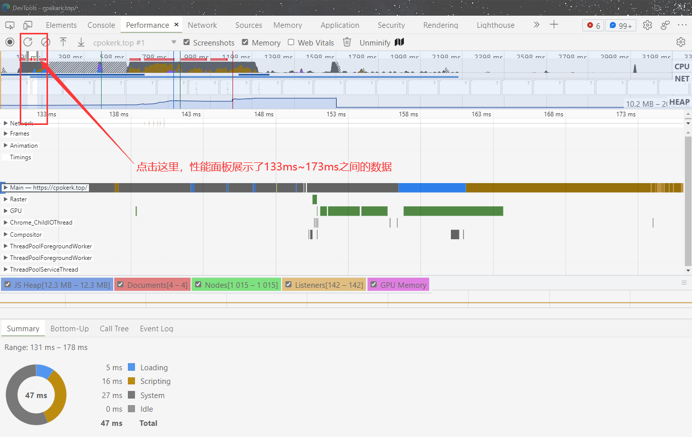

# Web Performance--浏览器开发者工具（二）


DevTools 里准确的来说有两个性能检测工具面板——`Lighthouse & Performance`。这两种工具能够准确统计页面在加载阶段和运行阶段的一些核心数据，比如任务执行记录、首屏展示花费时长等。有了这些关键数据，我们就能准确且容易定位到 Web 应用的性能瓶颈。

那接下来我们就先来看一下 Lighthouse 面板。

## Lighthouse

Lighthouse 面板相对来说使用起来比较简单，它将检测到的细节数据隐藏到了背后，只提供给我们一些直观易懂的性能数据，同时会给出一定的优化建议。

学以致用，我就用 Lighthouse 来分析一下我自己的博客吧~😈

打开[我的博客](https://cpokerk.top/)，`ctrl+shift+N`或`F12`打开 Lighthouse 工具。


然后一键式“傻瓜”操作，点击右侧的`Analyze page load` ，页面会自动刷新重新加载，然后静静等待几十秒，分析结果就会出现在我们眼前。


一份详细的性能报告就完成了，意想不到的是，给出的各项评分还不错，哈哈哈 😁。

### 解读性能报告

可以看到该站点在加载过程中的总体 Web 性能得分，总分是 100 分，我们目前的得分是 99，接近满分。这表示站点加载的性能还不错。


上面的一部分展示了 6 项主要的性能指标，分别是：

- First Contentful paint - 首次绘制
- Time to Interactive - 完全可交互时间
- Speed Index - 首屏时间
- Total Blocking Time - 总阻塞时间
- Largest Contentful Paint - 最大内容绘制时间
- Cumulative Layout Shift - 累积布局偏移

首先先看一下页面从加载到展示的过程图：


从上图，在渲染过程确认要渲染当前的请求后，渲染进程会创建一个空白页面，我们把创建空白页面的这个时间点称为`First Paint`，简称`FP`。

然后渲染进程继续请求关键资源，关键资源包 JavaScript 文件和 CSS 文件，因为关键资源会阻塞页面的渲染，所以我们需要等待关键资源加载完成后，才能执行进一步的页面绘制。

上图中，bundle.js 是关键资源，因此需要完成加载之后，渲染进程才能执行该脚本，然后脚本会修改 DOM，引发**重绘和重排**等一系列操作，当页面中绘制了第一个像素时，我们把这个时间点称为`First Content Paint`，简称 FCP。

接下来继续执行 JavaScript 脚本，当首屏内容完全绘制完成时，我们把这个时间点称为`Largest Content Paint`，简称`LCP`。

在`FCP`和`LCP`中间，还有一个`FMP`，这个是首次有效绘制，由于`FMP`计算复杂，而且容易出错，现在不推荐使用该指标。

接下来 JavaScript 脚本执行结束，渲染进程判断该页面的 DOM 生成完毕，于是触发`DOMContentLoad`事件。等所有资源都加载结束之后再触发`onload`事件。

### 指标分析

#### （1）First Contentful paint

如果 FP 时间过长，那么直接说明一个问题，页面的 HTML 文件**可能由于网络原因导致加载时间过久**，可以直接参考网络面板进行分析。

#### （2）Time to Interactive

TTI 表示页面中所有元素都达到了可交互的时长。简单理解就是这个时候页面的内容已经完全显示出来了，所有的 JavaScript 事件已经注册完成，页面能够对用户的交互做出快速响应，通常满足响应速度在 50 毫秒以内。如果要解决 TTI 时间过久的问题，**可以推迟执行一些和生成页面无关的 JavaScript 工作**。

#### （3）Speed Index

也就是上面提到的 LCP，它表示填满首屏页面所消耗的时间，首屏时间的值越大，那么加载速度越慢，**有可能是关键资源花费时间过久**，也就是可能是 JavaScript 执行过程中所花的时间过久。

#### （4）Total Blocking Time

可以参考：[TBT]([Total Blocking Time 总阻塞时间 (TBT) (web.dev)](https://web.dev/tbt/))

#### （5）Largest Contentful Paint

可以参考：[LCP]([Largest Contentful Paint 最大内容绘制 (LCP) (web.dev)](https://web.dev/lcp/))

#### （6）Cumulative Layout Shift

可以参考：(CLS)[[Cumulative Layout Shift 累积布局偏移 (CLS) (web.dev)](https://web.dev/cls/)]

### 报告其余部分

其余报告部分就是针对 Web 性能（Performance）、是否实施了无障碍功能（Accessibility）、Web 应用是否采用了最佳实践策略（Best practices）、Web 应用是否采用了 SEO 搜索引擎优化（SEO）PWA 程序性能（Progressive Web App）。

### 总结

通过了解，看来 Lighthouse 非常适合用来分析加载阶段的 Web 性能。我们可以先从简单的工具上手，练一练 Lighthouse 的使用。

## Performance

经过学习我们已经了解到了网络面板的内容，而还有一个非常重要的面板就是——`Performance`。它的重要体现在`Performance`可以记录站点在运行过程中的性能数据，有了这些性能数据，我们就可以回放整个页面的执行过程，方便定位和诊断每个时间段内页面的运行情况，从而有效帮助我们找出页面的性能瓶颈。

三步走：

1. 配置 Performance
2. 生成报告
3. 分析报告，找出页面性能瓶颈

### 配置 Performance

打开 Performance 面板。


蓝色标记中，第一部分是操作录制部分，用于控制录制、停止分析；第二部分是硬件配置栏，用于模拟不同 CPU 及网络环境下的情况；第三部分是快捷键的说明。

### 生成报告

点击第一部分中的第二个圆圈箭头按钮，网页开始录制性能分析数据。


根据报告大致可分为三个主要部分，概览面板、性能指标面板和详情面板。

首先我们先说一下时间线的概念，这是因为概览面板和性能指标面板都依赖于时间线。Performance 会按照时间的顺序来记录每个时间节点的性能数据，然后再按照时间顺序来展示这些性能数据，那么展示的时候就需要引入时间线。

比如上图中我们录制了 3298 毫秒，那么时间线的长度也就是 3298 毫秒，体现于上图中概览面板最上面的那条线。

#### 1.概览面板

引入了时间线，Performance 就会将几个关键指标，诸如**页面帧速（FPS）**、**CPU 资源消耗**、**网络请求流量**、**V8 内存使用量（HEAP）**等，按照时间线顺序以图表的形式体现，这就是概览面板。

有了概览面板，我们就能一览几个关键的数据指标，进而能快速定位到可能存在问题的时间节点。

- 如果 FPS 图表上出现了红色块 🟥，那么就表示红色块附近渲染出一帧所需时间过久，**帧的渲染时间过久**，就有可能导致页面卡顿。
- 如果 CPU 图形占用面积太大，表示 CPU 使用率就越高，那么就有**可能因为某个 JavaScript 占用太多的主线程时间**，从而影响其他任务的执行。
- 如果 V8 的内存使用量一直在增加，就有可能是某种原因导致了**内存泄露**。

除了以上指标以外，概览面板还展示加载过程中的几个关键时间节点，如 FP、LCP、DOMContentLoaded、Onload 等事件产生的时间点。这些关键时间点体现在了几条不同颜色的竖线上。

#### 2.性能面板

如果说概览面板是开胃餐，那么性能面板就是大餐了，需要我们慢慢分析消化。在性能面板中，记录了非常多的性能指标项，比如 `Main` 指标记录渲染主线程的任务执行过程，`Compositor` 指标记录了合成线程的任务执行过程，`GPU` 指标记录了 GPU 进程主线程的任务执行过程。

简言之，通过概览面板**定位问题的时间节点**，再用性能面板**分析时间节点内的性能数据**。

比如如下图概览面板 FPS 图表中出现了红色块 🟥，那么点击该红色块，性能面板就可以定位到红色块的时间节点内了。



> 使用技巧：可以使用鼠标滚轮缩放，也可以通过 W A S D 按键进行缩放和位置的移动。

#### 3.各项指标解读

浏览器的渲染机制非常复杂，所以渲染模块在执行渲染的过程中会被划分为很多子阶段，输入的 HTML 数据经过这些子阶段，最后输出到屏幕上的像素，这样的一个处理过程称为**渲染流水线**。一条完整的渲染流水线包括了*解析 HTML 文件生成 DOM、解析 CSS 生成 CSSOM、执行 JavaScript、样式计算、构造布局树、准备绘制列表、光栅化、合成、显示等*一系列操作。

渲染流水线主要是渲染进程中执行，在执行渲染流水线的过程中，渲染进程又需要网络进程、浏览器进程、GPU 等进程配合，才能完成如此复杂的任务。另外在渲染进程内部，又有很多线程来相互配合。具体可以参考下图：


了解了渲染流水线和浏览器的大致进程架构后，再来看性能面板下的各项指标的具体含义。

性能面板可以看到有很多指标，比如`Network`、`Frames`、`Main`、`GPU`等等。


##### Main 指标


观察上图，图上方一段一段的灰色横条，**每个灰色横条就对应一个任务，灰色长条的长度对应了任务的执行时长**。通常，渲染主线程上的任务都是比较复杂的，如果只单纯记录任务执行的时长，那么依然很难定位问题。因此还需要将任务执行过程中的一些关键的细节记录下来，这些细节就是**任务的过程**，灰线下面的横条就是一个个过程，同样这些横条的长度就代表这些过程执行的时长。

直观理解，可以把任务看成是一个 Task 函数，在执行 Task 函数的过程中，它会调用一些列的子函数，这些子函数就是我们所提到的**过程**。


上图这个图形可以看做是下面 Task 函数的执行过程：

```javascript
function A() {
  A1()
  A2()
}
function B() {}

function Task() {
  A()
  B()
}

Task()
```

结合上面的代码和图形，可以得出：

- Task 任务会首先调用 A
- 随后 A 又依次调用了 A1 和 A2，然后 A 执行完毕
- 随后 Task 任务又调用 B
- B 执行结束，Task 任务执行完成
- A 执行时间最长，所以在 A1 时，拉长了整个任务的执行时长

通过以上介绍，基本上掌握了`Main`指标中的任务，接下来需要结合`Main`指标来分析页面的加载过程。

先来分析一个简单的页面，代码如下：

```html
<html>
  <head>
    <title>Main</title>
    <style>
      area {
        border: 2px ridge;
      }

      box {
        background-color: rgba(106, 24, 238, 0.26);
        height: 5em;
        margin: 1em;
        width: 5em;
      }
    </style>
  </head>

  <body>
    <div class="area">
      <div class="box rAF"></div>
    </div>
    <br />
    <script>
      function setNewArea() {
        let el = document.createElement('div')
        el.setAttribute('class', 'area')
        el.innerHTML = '<div class="box rAF"></div>'
        document.body.append(el)
      }
      setNewArea()
    </script>
  </body>
</html>
```

代码很简单，只包含了一段 CSS 样式和一段 JavaScript 内嵌代码，其中在 JavaScript 中执行了操作 DOM。


如图可以看出，加载过程主要分为三个阶段，分别为：

1. 导航阶段，该阶段主要是从网络进程接收 HTML 响应头和 HTML 响应体；
2. 解析 HTML 数据阶段，该阶段主要是将接收到的 HTML 数据转换为 DOM 和 CSSOM；
3. 生成可显示的位图阶段，该阶段主要是利用 DOM 和 CSSOM，经过计算布局、生成层树(LayerTree)、生成绘制列表(Paint)、完成合成等操作，生成最终的图片。

接下来就按照这三个步骤来解读`Main`指标的数据。

###### 导航阶段


流程具体来讲：

- 该任务的第一个子过程就是`send request`，该过程表示网络请求已被发送，然后该任务进入了等待状态。
- 接着由网络进程负责下载资源，当接收到响应头的时候，该任务便执行`Receive Response`过程，该过程表示接收到 HTTP 的响应头了。
- 接着执行 DOM 事件：`pagehide`、`visibilitychange`、`unload`等事件，如果注册了这些事件的回调，那么这些回调会依次在该任务中被调用。
- 这些事件被处理完成之后，那么接下来就要接收 HTML 数据，这体现在`receive data`过程，`receive data`过程表示请求的数据已被接收，如果 HTML 数据过多，会存在多个`receive data`过程。

待所有的数据都接收完成之后，渲染进程会触发另外一个任务，该任务主要执行`Finish load`过程，该过程表示网络请求已经完成。

###### 解析 HTML 数据阶段


如上图，这个阶段主要任务就是通过解析 HTML 数据、解析 CSS 数据、执行 JavaScript 来生成`DOM`和`CSSOM`。

上图中可以看出，其中主要的一个过程是`HTMLParser`，顾名思义，这个过程就是用来解析 HTML 文件，解析的就是**上个阶段收到的 HTML 数据**。

1. `Evalute Script`，如果解析到了`script`标签，那么便进入了脚本执行过程。
2. 要执行一段脚本首先需要编译脚本，于是在`Evalute Script`过程中，先进入了脚本编译过程，也就是`Complie Script`。脚本编译好之后，就进入程序执行过程，执行全局代码时，V8 会先构造一个`anonymous`过程，在执行`anonymous`过程中，会调用`setNewArea`过程，`setNewArea`过程中又调用了`createElement`，由于之后调用了`document.append`方法，该方法会触发 DOM 内容的修改，所以又强制执行了`ParserHTML`过程生成的新的 DOM。
3. `DOM`生成完成之后，会触发相关的`DOM`事件，比如典型的`DOMContentLoaded`，还有`readyStateChanged`。

###### 生成可显示位图阶段

生成了 DOM 和 CSSOM 之后，进入第三阶段：生成页面上的位图。通常这需要经历布局、分层、绘制、合成等一系列操作，如下图。


在生成完了 DOM 和 CSSOM 之后，渲染主线程首先执行了一些 DOM 事件，诸如`readyStateChange`、`load`、`pageshow`。如果使用 JavaScript 监听了这些事件，那么这些监听的函数会被渲染主线程依次调用。

1. 首先执行布局，这个过程对应图中`Layout`。
2. 然后更新层树(LayerTree)，这个过程对应图中的`Update LayerTree`。
3. 有了层树之后，就需要为层树中的每一层准备绘制列表了，这个过程称为`Paint`。
4. 准备每层的绘制列表之后，就需要利用绘制列表来生成相应图层的位图了，这个过程对应图中的`Composite Layers`。

过了`Composite Layers`这一步，主线程的任务就完成了，接下来*主线程*会将合成的任务完全交给*合成线程*来执行。


结合渲染流水线和上图，再来梳理下最终图像是怎么显示出来的。

1. 首先主线程执行到`Composite Layers`过程之后，便会将绘制列表等信息提交给合成线程，合成线程的执行记录可以通过**Compositor 指标**来查看。
2. 合成线程维护了一个**Raster 线程池**，线程池中的每个线程称为**Rasterize**，用来执行光栅化操作，对应的任务就是**Rasterize Paint**。
3. 当然光栅化操作并不是在 Rasterize 中直接执行的，而是在 GPU 进程中执行的，因此 Rasterize 线程需要和 GPU 线程保持通信。
4. GPU 生成图像，最终这些图层会被提交给浏览器进程，浏览器进程将其合成并最终显示在页面上。

总结

通过 Main 指标，了解一个页面从加载到显示的流程，就会更容易分析页面性能，比如可以通过`Main`指标来分析**JavaScript 是否执行时间过长**，或者通过`Main`指标**分析代码里面是否存在强制同步布局等**操作，有了这些分析原因，就可以更有针对性的优化网页页面了。

##### Network 指标

该指标记录了一些关键的时间节点在何时产生的数据信息。

##### Timings 指标

该指标用来记录一些关键时间节点在何时产生的数据信息。

##### Frames 指标

该指标用来记录浏览器生成每一帧的记录，我们知道页面所展现出来的画面都是由渲染进程一帧一帧渲染出来的，帧记录就是用来记录渲染进程生成所有帧信息，包括了渲染出每一帧的时长、每一帧的图层构造等信息，可以点击对应的帧，在详细信息面板里查看具体的信息。

##### Interactions 指标

用来记录用户交互操作，比如点击鼠标、输入文字等交互信息。

#### 4.详情面板

该面板主要是以图形化的界面显示出各种指标的数据信息，可以通过在性能面板中选中性能指标中的任何历史数据，然后选中记录的细节信息就会展现在详情面板中了。

## 大总结

总而言之，工具要多用多练，才能孰能生巧，上面的概念性的内容很多，需要慢慢在使用过程中体会和消化，实践出真知！
