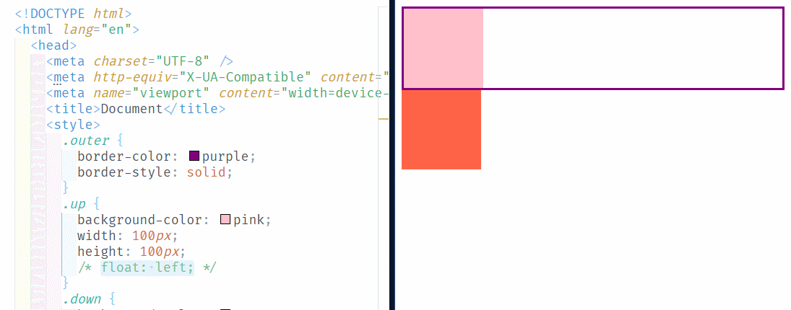
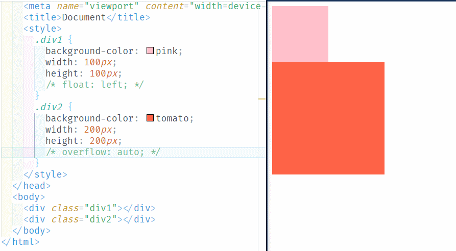
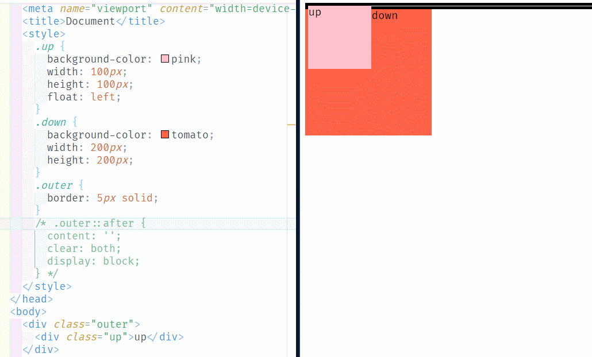

# 高度塌陷与 BFC

## 1.高度塌陷

在浮动布局中，父元素的高度默认是被子元素撑开的，当子元素浮动后，其会完全脱离文档流，子元素从文档流中脱离将会无法撑起父元素的高度，导致父元素的高度丢失。父元素高度丢失以后，其下的元素会自动上移，导致页面的布局混乱。

如下代码：

```html
<!DOCTYPE html>
<html lang="en">
  <head>
    <meta charset="UTF-8" />
    <meta http-equiv="X-UA-Compatible" content="IE=edge" />
    <meta name="viewport" content="width=device-width, initial-scale=1.0" />
    <title>Document</title>
    <style>
      .outer {
        border-color: aqua;
        border-style: solid;
      }
      .up {
        background-color: red;
        width: 100px;
        height: 100px;
        float: left;
      }
      .down {
        background-color: black;
        width: 100px;
        height: 100px;
      }
    </style>
  </head>
  <body>
    <div class="outer">
      <div class="up"></div>
    </div>
    <div class="down"></div>
  </body>
</html>
```

当我们给`outer`里的子元素设置浮动时，父元素`outer`自动上移，就像“坍塌”了一样。



所以高度塌陷是浮动布局中比较常见的一个问题，这个问题我们必须要进行处理！

# 2.BFC

BFC（Block Formatting Context）块级格式化环境：

- BFC 是一个 CSS 中的一个隐含的属性，可以为一个元素开启 BFC；
- 开启 BFC 该元素会变成一个独立的布局区域。

元素开启 BFC 后的特点：

- 不会被浮动元素覆盖；
- 父子元素外边距不会重叠；
- 可以包含浮动的元素。

可以通过一些特殊方式来开启元素的 BFC：

- 父元素也设置为浮动（不推荐）：很明显下方元素被覆盖了，总不能让所有元素都浮动吧。

```css
.outer {
	border-color: purple;
	border-style: solid;
    float: left;    <---------------------------------
}
.up {
    background-color: pink;
    width: 100px;
    height: 100px;
    float: left;
}
.down {
    background-color: tomato;
    width: 100px;
    height: 100px;
}
```

- 设置为行内块元素（不推荐）：不再独占一行，宽度变了，同时与下方元素产生了一点空隙；

```css
.outer {
	border-color: purple;
	border-style: solid;
    display: inline-block;    <---------------------------------
}
.up {
    background-color: pink;
    width: 100px;
    height: 100px;
    float: left;
}
.down {
    background-color: tomato;
    width: 100px;
    height: 100px;
}
```

- 设置`overflow`为非`visible`值：既没有覆盖元素，也保持了独占一方的特性（保持了宽度），与下方元素也保持了最初的间隙。常用的方式为元素设置`overflow:hidden`（`overflow:auto`也是 ok 的） 开启其 BFC， 以使其可以包含浮动元素`overflow:scroll` 会有滚动条，可能并不需要的，所以不太推荐。

```css
.outer {
	border-color: purple;
	border-style: solid;
    overflow: auto;    <---------------------------------
}
.up {
    background-color: pink;
    width: 100px;
    height: 100px;
    float: left;
}
.down {
    background-color: tomato;
    width: 100px;
    height: 100px;
}
```

不过这种方式也有一定的问题，比如，`overflow`并没有完全清除`div2`在布局上受到的影响：



**总结：**

- 可以通过变成浮动元素，来防止自身被浮动元素覆盖；
- 可以设置行内块，来防止自身及其他元素被浮动元素覆盖（如果说浮动是“独善其身”，那行内块就有点“兼济天下”的意思）；
- 可以设置`overflow`属性，包含浮动元素（既“独善其身”，又“兼济天下”，但仍有缺陷）。

以下有很多种开启 BFC 的方式：

|                                                                      元素或属性                                                                      | 说明                                                                             |
| :--------------------------------------------------------------------------------------------------------------------------------------------------: | -------------------------------------------------------------------------------- |
|                                                                       `<html>`                                                                       | 文档根元素                                                                       |
|                                                             `float: left` `float: right`                                                             | 浮动元素（`float`不为`none`）                                                    |
|                                                        `position: absolute` `position: fixed`                                                        | 绝对定位元素                                                                     |
|                                                               `display: inline-block`                                                                | 行内块元素                                                                       |
|                                                                `display: table-cell`                                                                 | 表格单元，默认值                                                                 |
|                                                               `display: table-caption`                                                               | 表格标题，默认值                                                                 |
| `display: table` `display: table-row` `display: table-row-group` `display: table-header-group` `display: table-footer-group` `display: inline-table` | 匿名的表格单元，分别是 HTML 表格、表行、表体、表头和表脚的默认值                 |
|                                                `overflow: hidden` `overflow: scroll` `overflow: auto`                                                | `overflow`不为`visible`和`clip`的块元素                                          |
|                                                                 `display: flow-root`                                                                 |                                                                                  |
|                                                         `contain: layout` `contain: content`                                                         |                                                                                  |
|                                                  `display: flex` `display: inline-flex`的直接子元素                                                  | Flex 项，如果它们本身既不是`flex`，也不是`grid`或`table`容器                     |
|                                                  `display: grid` `display: inline-grid`的直接子元素                                                  | Grid 项，如果它们本身既不是`flex`，也不是`grid`或`table`容器                     |
|                                                 `column-count`不为`auto` ；`column-width`不为`auto`                                                  | Multicol 容器，包含`column-count: 1`                                             |
|                                                                  `column-span: all`                                                                  | 应该总是创建一个新的格式化上下文，即使`column-span: all`元素不在 multicol 容器中 |

但是，注意不管哪种方式，多多少少都会有些隐患、缺陷或者说“副作用”。

## 3.clear

```html
<!DOCTYPE html>
<html lang="en">
  <head>
    <meta charset="UTF-8" />
    <meta http-equiv="X-UA-Compatible" content="IE=edge" />
    <meta name="viewport" content="width=device-width, initial-scale=1.0" />
    <title>Document</title>
    <style>
      .div1 {
        background-color: pink;
        width: 100px;
        height: 100px;
        float: left;
      }
      .div2 {
        background-color: tomato;
        width: 200px;
        height: 200px;
        float: right;
      }
      .div3 {
        background-color: chartreuse;
        width: 300px;
        height: 300px;
        clear: both;
      }
    </style>
  </head>
  <body>
    <div class="div1">1</div>
    <div class="div2">2</div>
    <div class="div3">3</div>
  </body>
</html>
```

`clear`作用：清除浮动元素对当前元素所产生的影响（本质是为元素添加一个`margin-top`属性，值由浏览器自动计算）。

可选值：

- `left` 清楚左侧浮动元素对当前元素的影响
- `right` 清楚右侧浮动元素对当前元素的影响
- `both` 清楚两侧中影响较大一侧元素的影响（注意，这里不是同时清除两侧的影响）

## 4.after

通过以上学习，我们知道了高度塌陷的解决方式，其中主要有：

- 通过`overflow: hidden`等可以为元素开启 BFC；
- 通过`clear: both`等可以清除浮动元素产生的影响。

但同时，这两种方式都一定的弊端和隐患，那有没有一种更好的方式来解决高度塌陷的问题呢？

答案是：使用伪元素`::after`。

```html
<!DOCTYPE html>
<html lang="en">
  <head>
    <meta charset="UTF-8" />
    <meta http-equiv="X-UA-Compatible" content="IE=edge" />
    <meta name="viewport" content="width=device-width, initial-scale=1.0" />
    <title>Document</title>
    <style>
      .up {
        background-color: pink;
        width: 100px;
        height: 100px;
        float: left;
      }
      .down {
        background-color: tomato;
        width: 200px;
        height: 200px;
      }
      .outer {
        border: 5px solid;
      }
      .outer::after {
        content: '';
        clear: both;
        display: block;
      }
    </style>
  </head>
  <body>
    <div class="outer">
      <div class="up">up</div>
    </div>
    <div class="down">down</div>
  </body>
</html>
```

Q1：这里使用了一个伪元素选择器`::after`，那有人会问了，相比在`up`下直接定义一个`div`有什么区别呢？

A：我们知道，网页的结构思想是：结构+表现+行为。在`up`下直接定义一个`div`，属于结构；而使用伪元素选择器，属于表现。而高度塌陷问题属于表现问题，定义`div`的目的是为了撑起`outer`的内容，属于表现，而不是结构，所以在 css 中定义`::after`更符合网页的编程思想。

Q2：为什么需要使用`display: block`呢？

A：因为默认情况下，`::after`伪元素是一个行内元素，如果不转为块元素，将仍然撑不起`outer`的高度。

所以使用`after`的大致原理就是：使用无内容的`div`撑起来`outer`，然后用`clear`清除浮动对元素产生的影响。

## 5.clearfix

`clearfix`这个样式可以同时解决高度塌陷和外边距重叠的问题。

当遇到这样的问题时，直接使用`clearfix`即可轻松搞定 css 中的两大难题：

```css
.clearfix::before,
.clearfix::after {
  content: '';
  display: table;
  clear: both;
}
```

其中，.clearfix::before 是为了解决外边距重叠问题；

```css
.clearfix::before {
  content: '';
  display: table;
}
```

.clearfix::after 是为了解决高度塌陷的问题。

```css
.clearfix::after {
  content: '';
  display: table;
  clear: both;
}
```
