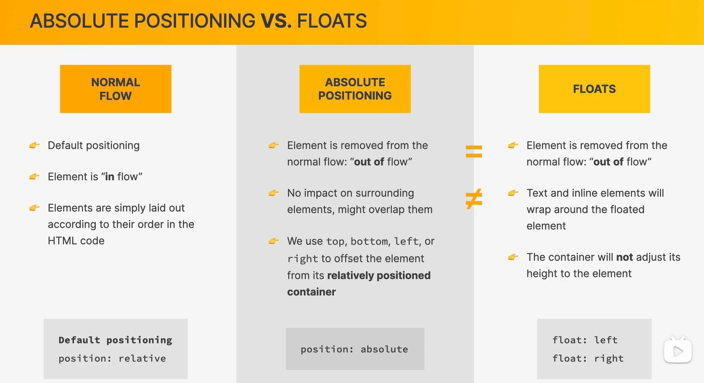
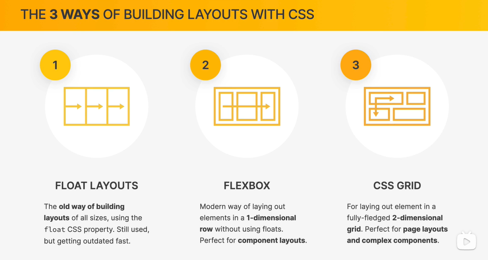
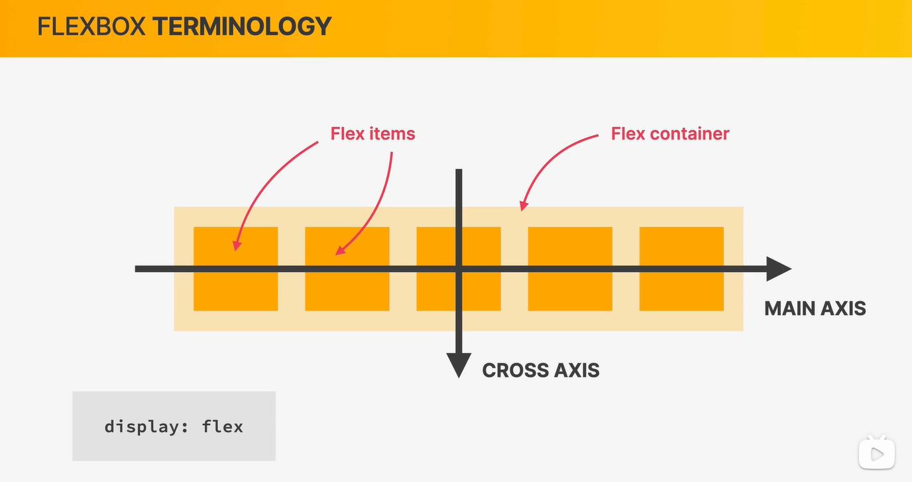
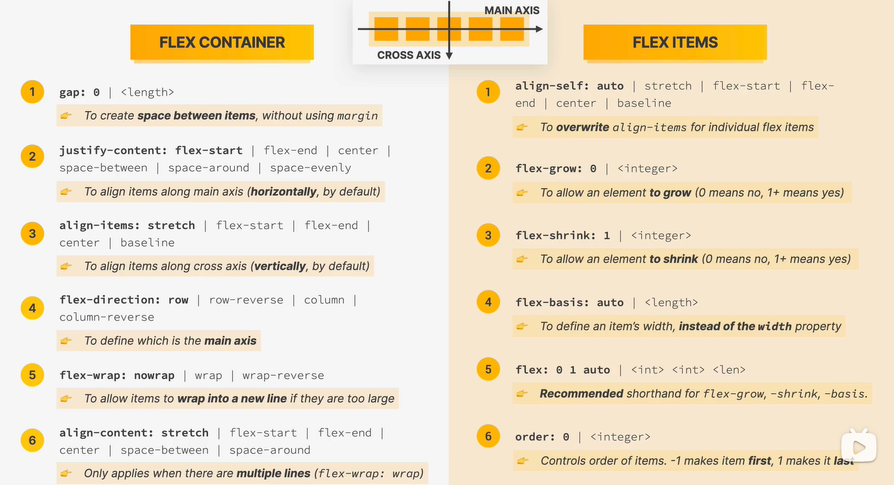

**float 布局、flex 布局和 grid 布局**<br />

# 弹性盒简介

## 1、基本概念



### 弹性盒

`flex`（弹性盒、伸缩盒）

- 是`css`中的又一种布局手段，它主要用来代替浮动来完成页面的布局
- `flex`可以使元素具有弹性，让元素可以跟随页面的大小的改变而改变



### 弹性容器

要使用弹性盒，必须先将一个元素设置为弹性容器

我们通过`display` 来设置弹性容器

- `display:flex` 设置为块级弹性容器
- `display:inline-flex` 设置为行内的弹性容器

```css
/* 设置弹性容器 */
display: flex;
```


### 弹性元素

弹性容器的子元素是弹性元素（弹性项）

弹性元素可以同时是弹性容器

## 2、弹性容器的属性

**主轴与侧轴**

- 主轴：弹性元素的排列方向称为主轴
- 侧轴：与主轴垂直方向的称为侧轴

### 主轴属性

#### 排列方式

`flex-direction` 指定容器中弹性元素的排列方式

- `row`默认值，弹性元素在容器中水平排列（自左向右）
- `row-reverse` 弹性元素在容器中反向水平排列（自右向左）
- `column` 弹性元素纵向排列（自上向下）
- `column-reverse` 弹性元素反向纵向排列（自下向上）

```css
/* 设置弹性元素排列方式 */
flex-direction: column;
```


#### 自动换行

`flex-wrap` 设置弹性元素是否在弹性容器中自动换行

- `nowrap` 默认值，元素不会自动换行
- `wrap` 元素沿着辅轴方向自动换行

```css
/* 设置弹性元素排列方式 */
flex-direction: row;
/* 设置自动换行 */
flex-wrap: wrap;
```


**简写属性**

`flex-flow` 是`wrap`和`direction`的简写属性

```css
/* 简写属性 */
flex-flow: row wrap;
```


#### 空白空间

`justify-content` 如何分配主轴上的空白空间（主轴上的元素如何排列）

- `flex-start` 元素沿着主轴起边排列<br />
- `flex-end` 元素沿着主轴终边排列<br />
- `center` 元素居中排列<br />
- `space-around` 空白分布到元素两侧<br />
- `space-between` 空白均匀分布到元素间<br />
- `space-evenly` 空白分布到元素的单侧<br />

### 辅轴属性

#### 辅轴对齐

`align-items`元素在辅轴上如何对齐

- `stretch` 默认值，将元素的长度设置为相同的值<br />
- `flex-start` 元素不会拉伸，沿着辅轴起边对齐<br />
- `flex-end` 沿着辅轴的终边对齐<br />
- `center` 居中对齐<br />
- `baseline` 基线对齐<br />

#### 空白空间

`align-content` 如何分配辅轴上的空白空间（辅轴上的元素如何排列）

- `flex-start` 元素沿着辅轴起边排列<br />
- `flex-end` 元素沿着辅轴终边排列<br />
- `center` 元素居中排列<br />
- `space-around` 空白分布到元素两侧<br />
- `space-between` 空白均匀分布到元素间<br />
- `space-evenly` 空白分布到元素的单侧<br />

### 弹性居中

利用弹性盒对元素进行水平垂直双方向居中

```css
justify-content: center;
align-items: center;
```


## 3、弹性元素的属性

### 伸展系数

`flex-grow` 指定弹性元素的伸展系数，默认值为 0

- 当父元素有多余空间的时，子元素如何伸展
- 父元素的剩余空间，会按照比例进行分配

```css
li:nth-child(1) {
  background-color: #bfa;
  flex-grow: 1;
}

li:nth-child(2) {
  background-color: red;
  flex-grow: 2;
}

li:nth-child(3) {
  background-color: green;
  flex-grow: 3;
}
```


### 缩减系数

`flex-shrink` 指定弹性元素的收缩系数，默认值为 1

- 当父元素中的空间不足以容纳所有的子元素时，如何对子元素进行收缩
- 缩减系数的计算方式比较复杂，缩减多少是根据 _缩减系数_ 和 _元素大小_ 来计算

```css
li:nth-child(1) {
  background-color: #bfa;
  flex-shrink: 1;
}

li:nth-child(2) {
  background-color: red;
  flex-shrink: 2;
}

li:nth-child(3) {
  background-color: green;
  flex-shrink: 3;
}
```


### 基础长度

`flex-basis` 指定的是元素在主轴上的基础长度

- 如果主轴是横向的，则该值指定的就是元素的宽度
- 如果主轴是纵向的，则该值指定的就是元素的高度
- 默认值是`auto`，表示参考元素自身的高度或宽度
- 如果传递了一个具体的数值，则以该值为准

```css
li:nth-child(1) {
  background-color: #bfa;
  flex-basis: 200px;
}
```


**简写属性**

`flex`可以设置弹性元素所有的三个样式 `flex: 增长 缩减 基础`

- `initial`：`flex: 0 1 auto`
- `auto`：`flex: 1 1 auto`
- `none`：`flex: 0 0 auto` 弹性元素没有弹性

### 排列顺序

`order` 决定弹性元素的排列顺序

```css
li:nth-child(1) {
  background-color: #bfa;
  order: 2;
}

li:nth-child(2) {
  background-color: red;
  order: 3;
}

li:nth-child(3) {
  background-color: green;
  order: 1;
}
```


### 覆盖辅轴

`align-self` 用来覆盖当前弹性元素上的`align-items`

```css
li:nth-child(1) {
  background-color: #bfa;
  align-self: flex-end;
}
```


**一图总结**<br />


