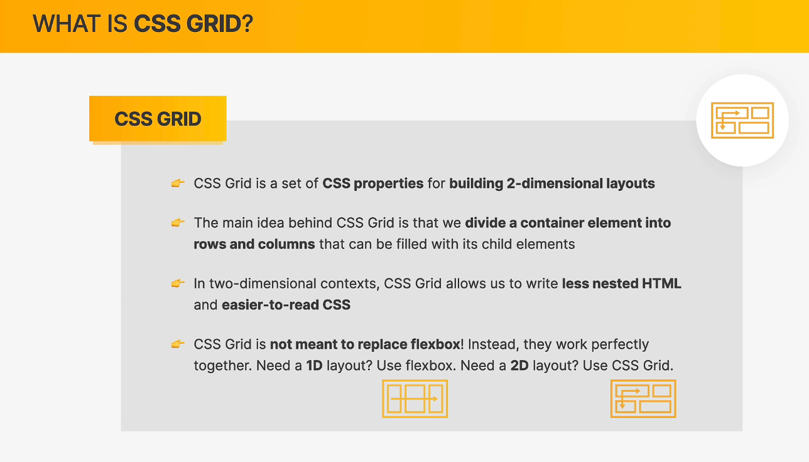
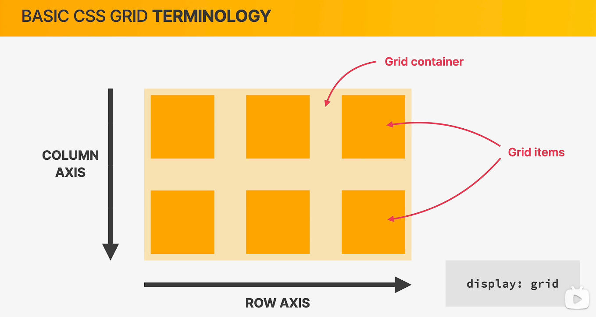
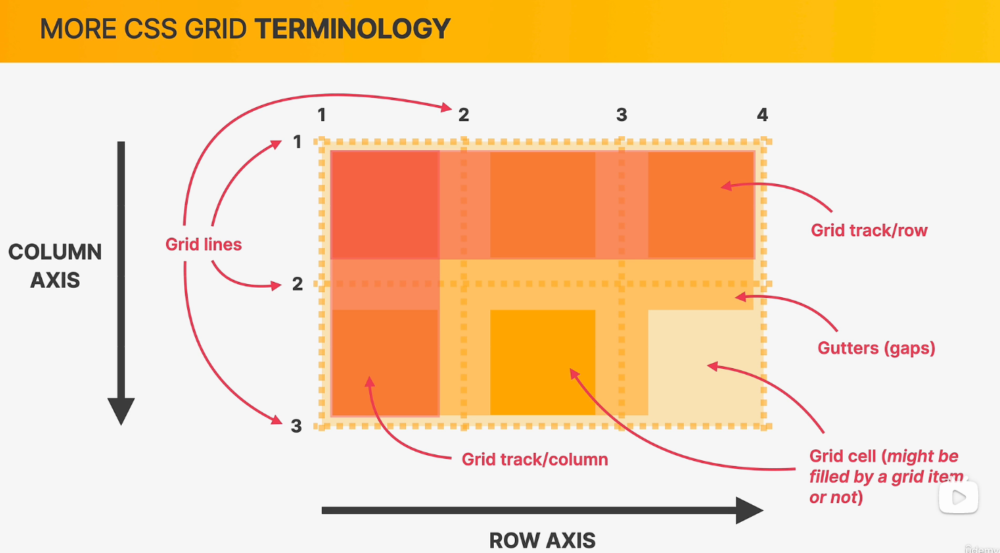
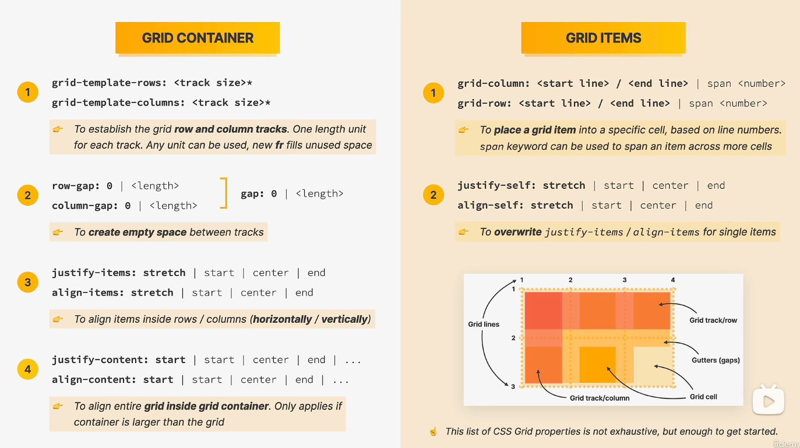

<a name="h3I9j"></a>

# 什么是 CSS grid？

CSS grid 可以和 flex 布局相互搭配，相得益彰。flex 布局主要用于一维布局，CSS grid 主要用于二维布局。<br />

使用 CSS grid 布局需要给**容器（Grid container**）配置：

```css
.container{
  display: grid;
  /* 行row数 */
  grid-template-row:
  /* grid-template-rows: 1fr 1fr 2fr 2fr; */
  grid-template-rows: repeat(2, 1fr);
  /* 列row数 */
  /* grid-template-columns: 100px 100px 200px 100px; */
  /* grid-template-columns: 1fr 1fr 2fr 1fr; */
  grid-template-columns: repeat(4, 1fr);
  /* 格子之间的行列距离 */
  row-gap: 15px;
  column-gap: 25px;
  /* align-content 和 justify-content的简写 */
  place-content: ;
}
```

行列会分割为多个**格子（Grid items）**：

```css
.items {
  grad-row: ;
  grad-column: ;
  grad-area: ;
  /* 水平对其 */
  justify-self: ;
  /* 垂直对其 */
  align-self: ;
}
```

<br />更多的 CSS gird 术语：

- Grid lines：栅格线
- Grid track/column：栅格列
- Grid track/row：栅格行
- Gutters(gaps)：栅格间隙
- Grid cell：栅格

<br />**cheat sheet：**<br />
