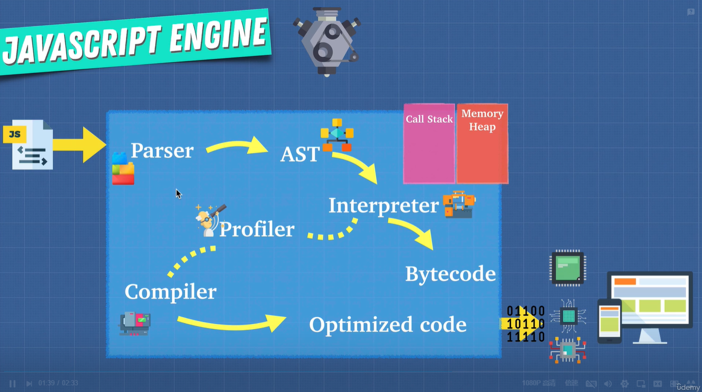

# JavaScript 函数式编程



## 浏览器中的优化：

### [hidden class](https://medium.com/swlh/writing-optimized-code-in-js-by-understanding-hidden-classes-3dd42862ad1d)

```javascript
function Animal(x, y) {
  this.x = x
  this.y = y
}
const obj1 = new Animal(1, 2)
const obj2 = new Animal(3, 4)
obj1.a = 50
obj1.b = 100
obj2.b = 100
obj2.a = 50
```

### inline caching

```javascript
function findUser(user){
  return ${user.firstname} ${user.lastname};
}
const user = {
  firstname: 'erik',
  lastname: 'xue'
}
for(let i=0; i<1000; i++){
  console.log(findUser(user);
}
```

## Memory Leak

```javascript
// Global Variable
var a = 1
var b = 1
var c = 1

// Event Listeners
var element = document.getElementById('button')
element.addEventListener('click', onClick)

// setInterval
setInterval(() => {
  // referencing objects
})
```

[**模拟 JS 执行的网站**](http://latentflip.com/loupe)

## call() / apply()

call()函数可以理解为对象调用内部的函数，比如：

```javascript
const wizard = {
  name: 'Merlin',
  health: 50,
  heal() {
    return (this.health = 100)
  },
}

const archer = {
  name: 'Robin Hood',
  health: 30,
}

wizard.heal.call() // 100
wizard.heal.apply() // 100
```

但是如果 archer 对象也想使用 heal()函数，那么就可以使用 call() \ apply() 来“借用”wizard 中的 heal 函数。

```javascript
const wizard = {
  name: 'Merlin',
  health: 50,
  heal(num1, num2) {
    return (this.health += num1 + num2)
  },
}

const archer = {
  name: 'Robin Hood',
  health: 30,
}

console.log('1', archer) // 1 {name: 'Robin Hood', health: 30}
wizard.heal.call(archer, 66, 99)
console.log('2', archer) // 2 {name: 'Robin Hood', health: 195}

// call() 和 apply()的区别在于第二个参数apply可以放数组
wizard.heal.apply(archer, [66, 99])
```

JavaScript 类型转换（type coercison）<br />[https://dorey.github.io/JavaScript-Equality-Table/](https://dorey.github.io/JavaScript-Equality-Table/)

## Closure

闭包可以暴露想暴露的变量，隐藏变量不被外部所修改。

```javascript
const fuck = (company) => (department) => (employee) => console.log(`${company} --- ${department} --- ${employee}`)
fuck('西安葡萄城软件有限公司')('客户服务部')('薛禹坤')
// 西安葡萄城软件有限公司 --- 客户服务部 --- 薛禹坤
```

```javascript
function callMeMaybe() {
  setTimeout(() => console.log(fuck), 4000)
  const fuck = 'shit'
}
```

```javascript
function heavyDuty(index) {
  const bigArray = new Array(8888).fill('😀')
  return bigArray[index]
}

heavyDuty(666)
heavyDuty(777)
haevyDuty(888)

function heavyDuty2() {
  const bigArray = new Array(6666).fill('😀')
  console.log('created Again!')
  return function (index) {
    return bigArray[index]
  }
}

const getHeavyDuty2 = heavyDuty()
getHeavyDuty2(666)
getHeavyDuty2(777)
getHeavyDuty2(888)
```

```javascript
const makeNuclearButton = () => {
  let timeWithoutDestruction = 0
  const passTime = () => timeWithoutDestruction++
  const totalPeaceTime = () => timeWithoutDestruction
  const launch = () => {
    timeWithoutDestruction = -1
    return '💥'
  }
  setInterval(passTime, 1000)
  return {
    launch: launch,
    totalPeaceTime: totalPeaceTime,
  }
}

const ohno = makeNuclearButton()
ohno.totalPeaceTime()
```

### 闭包练习一

```javascript
let view
function initialize() {
  view = '🏔'
  console.log('view has been created~')
}

/* ------------------------------------ */
let view
function initialize() {
  let called = 0
  return function () {
    if (called > 0) {
      return
    } else {
      view = '🏔'
      called++
      console.log('view has been created~')
    }
  }
}
```

### 闭包练习二

```javascript
const array = [1, 2, 3, 4]
for (var i = 0; i < array.length; i++) {
  setTimeout(function () {
    console.log('I am at index ' + i)
  }, 3000)
}
// output: 4 I am at index 4

const array = [1, 2, 3, 4]
for (let i = 0; i < array.length; i++) {
  setTimeout(function () {
    console.log('I am at index ' + i)
  }, 3000)
}
// output:
// I am at index 0
// I am at index 1
// I am at index 2
// I am at index 3

const array = [1, 2, 3, 4]
for (var i = 0; i < array.length; i++) {
  ;(function (closureI) {
    setTimeout(() => {
      console.log('I am at index ' + closureI)
    }, 3000)
  })(i)
}
```

## prototype / **proto**

```javascript
// #1
// Date object => to have new method. lastYear() which shows you last year 'YYYY' format.

let date = new Date()
date.lastYear = function () {
  return this.getFullYear() - 1
}

Date.prototype.lastYear = function () {
  return this.getFullYear() - 1
}

new Date('1900-10-02').lastYear()

// #2
// Modify .map() to print '🌍' at the end of each item.
Array.prototype.map = function () {
  let array = []
  for (let i = 0; i < this.length; i++) {
    array.push(`${this[i]}🌍`)
  }
  return array
}

console.log([1, 2, 3].map())
// 1🌍, 2🌍, 3🌍
```

#### Object.create();

```javascript
const elfFunctions = {
  attck() {
    return `attack with ${this.weapon}`
  },
}
function createElf(name, weapon) {
  let newElf = Object.create(elfFunctions)
  newElf.name = name
  newElf.weapon = weapon
  return newElf
}

const peter = createElf('Peter', 'stones')
console.log(peter.attack())
const sam = createElf('Sam', 'fire')
console.log(sam.attack())
```

#### Constructor Functions

```javascript
function Elf(name, weapon) {
  this.name = name
  this.weapon = weapon
}

Elf.propotyupe.attack = function () {
  return `attack with ${this.weapon}`
}
Elf.propotype.build = function () {
  // 2.
  const self = this
  function building() {
    // 1. return `${this.name} build a house`
    // 2.
    return `${self.name} build a house`
  }
  // 1. return building.bind(this)
  // 2.
  return building()
}

const peter = new Elf('Peter', 'stones')
console.log(peter.attack())
const sam = new Elf('Sam', 'fire')
console.log(sam.attack())

console.log(peter.build()())
```

#### ES6 Class

```javascript
class Elf {
  constructor(name, weapon) {
    this.name = name
    this.weapon = weapon
  }
  attack() {
    return `attack with ${this.weapon}`
  }
}
```

#### this 4 ways

```javascript
// new binding this
function Person(name, age) {
  this.name = name
  this.age = age
}

const person1 = new Person('xxx', 34)

// implicit binding
const person = {
  name: 'yyy',
  age: 40,
  hi() {
    console.log('hi' + this.name)
  },
}

// explicit binding
const person3 = {
  name: 'zzz',
  age: 50,
  hi: function () {
    console.log('hi' + this.setTimeout)
  }.bind(window),
}
person3.hi()

// arrow function
const person4 = {
  name: 'ttt',
  age: 60,
  hi: function () {
    var inner = () => {
      console.log('hi' + this.name)
    }
    return inner()
  },
}
```

## Functional Programming

<br />

```javascript
// Amazon shopping
const user = {
  name: 'Kim',
  active: true,
  cart: [],
  purchases: [],
}

purchaseItem

// Implement a cart feature:
//  1. Add items to cart.
//  2. Add 3% tax to item in cart.
//  3. Buy item: cart --> purchases.
//  4. Empty cart.

// Bonus:
//  accept refunds.
//  Track user history.
```

**pure function ??? Referential Transparency ???**

函数式编程的目的不是为了让一切都成为 pure function，目的是为了减少 side effect。<br />Function：

- 1 Task
- return Statement
- Pure
- No shared state
- Immutable State
- Composable
- Predictable

```javascript
// Ideempotence
// 函数无论执行多少次返沪结果都是一样的，且可预测
function a(num) {
  console.log(num)
}
a()
Math.abs(Math.abs(-50))
```

```javascript
// Imperative vs Declerative
for (let i = 0; i < 1000; i++) {
  console.log(i)
}

;[1, 2, 3].forEach((item) => console.log(item))
```

```javascript
// Immutability
const obj = { name: 'Andrei' }
function clone(obj) {
  return { ...obj } // this is pure
}

function updateName(obj) {
  const obj2 = clone(obj)
  obj2.name = 'Nana'
  return obj2
}
const updateObj = updateName(obj)
console.log(obj, updateObj)
```

```javascript
// HOF
const hof = (fn) => fn(5)
hof(function a(x) {
  return x
})
// Closure
const closure = function () {
  let count = 55
  return function getCounter() {
    return count
  }
}
const getCounter = closure()
getCounter()
```

```javascript
// curring
const multipy = (a, b) => a * b
const curriedMultiply = (a) => (b) => a * b
// 调用curriedMultiply该函数一次，这个函数就被记住了
// 直到程序运行结束
const curriedMultiplyBy5 = curriedMultiply(5)

// 10 years
// 10年后，我们想起来调用curriedMultiplyBy5，无论运行多少次，curriedMultiply只运行一次
curriedMultiplyBy5(4)
curriedMultiplyBy5(5)
curriedMultiplyBy5(6)
```

```javascript
// Partial Application
const multiply = (a, b, c) => a * b * c
const partialMultiplyBy5 = multiply.bind(null, 5)
partialMultiplyBy5(4, 10)
// 200
```

### Memoization

```javascript
function memoizedAddTo80() {
  let cache = {}
  return function (n) {
    if (n in cache) {
      return cache[n]
    } else {
      console.log('long time ago...')
      cache[n] = n + 80
      return cache[n]
    }
  }
}
const memoized = memoizedAddTo80()
console.log('1', memoized(5))
console.log('1', memoized(5))
console.log('1', memoized(5))
```

[Ramda Documentation](https://ramdajs.com/docs)

```javascript
// Compose
const compose = (f, g) => (data) => f(g(data))
const multiplyBy3 = (num) => num * 3
const makePositive = (num) => Math.abs(num)
const multiplyBy3AndAbsolute = compose(multiplyBy3, makePositive)

multiplyBy3AndAbsolute(-50)
// 150

// Pipe
const pipe = (f, g) => (data) => g(f(data))

// fn1(fn2(fn3(num)));
// compose: compose(fn1, fn2, fn3)(50);
// pipe: pipe(fn3, fn2, fn1)(50);
```

```javascript
// Amazon shopping
const user = {
  name: 'Kim',
  active: true,
  cart: [],
  purchases: [],
}

const history = []

/*
const compose = (f, g) => {
    return (...args) => {
        return f(g(...args))
    }
}
*/
// emptyCart(buItem(applyTaxItems(addItemToCart)))

const compose =
  (f, g) =>
  (...args) =>
    f(g(...args))
const item = { label: 'loptop', price: 3000 }
const result = purchaseItem(emptyCart, buyItem, applyTaxToItems, addItemToCart)(user, item)

function purchaseItem(...fns) {
  return fns.reduce(compose)
}

function addItemToCart(user, item) {
  history.push(user)
  const updatedCart = user.cart.concat(item)
  return Object.assign({}, user, { cart: updatedCart })
}

function applyTaxToItems(user) {
  history.push(user)
  let taxRate = 1.3
  // 解构对象,从user对象中取出cart属性值
  const { cart } = user || {}
  const updatedCart = cart.map((item) => {
    return {
      label: item.label,
      price: taxRate * item.price,
    }
  })
  return Object.assign({}, user, updatedCart)
}

function buyItem(user) {
  history.push(user)
  return Object.assign({}, user, { purchases: user.cart })
}

function emptyCart(user) {
  history.push(user)
  return Object.assign({}, user, { cart: [] })
}

function refunds() {}

console.log(history)

console.log(result)
// Implement a cart feature:
//  1. Add items to cart.
//  2. Add 3% tax to item in cart.
//  3. Buy item: cart --> purchases.
//  4. Empty cart.

// Bonus:
//  accept refunds.
//  Track user history.
```

## Asynchronous Javascript

- Web APIs
- Async/Await
- Callbacks
- Microtask Queue(Job Queue)
- Task Queue(Callback Queue)
- Promises
- Event loop


```javascript
// callback pyramid of doom

// example 1
movePlayer(100, 'Left', function() {
  movePlayer(400, 'Left', function() {
    moverPlayer(10, 'Right', function() {
      movePlayer(330, 'Left', function() {
      });
    });
  });
});

// example 2
grabTweets('twitter/andreineagoie', (error, xxxTweets) => {
  if(error) {
    throw Error;
  }
  displayTweets(xxxTweets)
  grabTweets('twitter/elonmusk', (error, elonTweets) => {
    if(error) {
      throw Error;
    }
    displayTweets(elonTweets)
    grabTweets('twitter/vitalikbuterin', (error, vitalikTweets) => {
      if(error) {
        throw Error;
      }
      displayTweets(vitalikTweets)
  })
})
```

```javascript
const promise = new Promise((resolve, reject) => {
  if (true) {
    resolve('Stuff Worked')
  } else {
    reject('Error, it broke')
  }
})

const promise2 = new Promise((resolve, reject) => {
  setTimeout(resolve, 100, 'HIII')
})
const promise3 = new Promise((resolve, reject) => {
  setTimeout(resolve, 1000, 'POOKIE')
})
const promise4 = new Promise((resolve, reject) => {
  setTimeout(resolve, 5000, 'Is it me you are looking for?')
})

Promise.all([promise, promise2, promise3, promise4]).then((values) => {
  console.log(values)
})

promise
  .then((result) => result + '!')
  .then((result2) => result2 + '?')
  .catch(() => console.log('error!'))
  .then((result3) => {
    console.log(result3 + '!')
  })
```

```javascript
const urls = [
  'https://jsonplaceholder.typicode.com/users',
  'https://jsonplaceholder.typicode.com/posts',
  'https://jsonplaceholder.typicode.com/albums',
]

Promise.all(
  urls.map((url) => {
    return fetch(url).then((response) => response.json())
  })
)
  .then((results) => {
    console.log(results[0])
    console.log(results[1])
    console.log(results[2])
  })
  .catch('oops!')
```

```javascript
// example 1
movePlayer(100, 'Left')
  .then(() => movePlayer(400, 'Left'))
  .then(() => movePlayer(10, 'Right'))
  .then(() => movePlayer(330, 'Left'))

async function playerStart() {
  const firstMove = await movePlayer(100, 'Left')
  await movePlayer(400, 'Left') // pause
  await movePlayer(10, 'Right') // pause
  await movePlayer(10, 'Right') // pause
}

// example 2
fetch('https://jsonplaceholder.typicode.com/users')
  .then((response) => response.json())
  .then(console.log)

async function fetchUses() {
  const response = await fetch('https://jsonplaceholder.typicode.com/users')
  const data = await response.json()
  console.log(data)
}

// example 3
const urls = [
  'https://jsonplaceholder.typicode.com/users',
  'https://jsonplaceholder.typicode.com/posts',
  'https://jsonplaceholder.typicode.com/albums',
]

Promise.all(
  urls.map((url) => {
    return fetch(url).then((response) => response.json())
  })
)
  .then((results) => {
    console.log('users', results[0])
    console.log('posts', results[1])
    console.log('albums', results[2])
  })
  .catch('oops!')

async function getData() {
  try {
    const [users, posts, albums] = await Promise.all(
      urls.map((url) => {
        return fetch(url).then((response) => response.json())
      })
    )
    console.log('users', users)
    console.log('posts', posts)
    console.log('albums', albums)
  } catch (error) {
    console.log('opps!', error)
  }
}
```


```javascript
// 1.Callback Queue - Task Queue
setTimeout(() => {
  console.log('1', 'is the loneliest number')
}, 0)
setTimeout(() => {
  console.log('2', 'can be as bad as one')
}, 10)

// 2.Job Queue - Microtask Queue
// 通常情况下，Job Queue优先检查，因为它具有更高的优先级
Promise.resolve('hi').then((data) => console.log('2', data))
```

[----------------> 45 道 Promise 面试题 <----------------](https://juejin.cn/post/6844904077537574919)

```javascript
setTimeout(() => {
  console.log('1', 'is the loneliest number')
}, 0)
Promise.resolve('hi').then(() => console.log('2'))
console.log('3', 'is a crowd')

// 3
// 2
// 1

// script -> 微任务 -> 宏任务
```

web worker

## Modules in Javascript

- Native ES Modules
- CommonJS
- UMD
- AMD
- IIFE

```javascript
// IIFE
// Module Pattern
// example 1
var fightModule = (function () {
  var harry = 'potter'
  var voldmort = 'He who must not be named'

  function fight(char1, char2) {
    var attack1 = Math.floor(Math.random() * char1.length)
    var attack2 = Math.floor(Math.random() * char2.length)
    return attack1 > attack2 ? `${char1} wins` : `${char2} wins`
  }
  console.log(fight(harry, voldmort))
  // 可以通过 return 暴露想暴露的方法或变量
  return {
    fight: fight,
  }
})()

// example 2
var globalSecret = '1234'
// 通过参数传递传入到IIFE中的形参，就不会影响到全局变量
var script2 = (function ($, globalSecret) {
  $('h1').click(function () {
    $('h1').hide()
  })
  $ = undefined
  globalSecret = '0'
})($, globalSecret)

/*
  缺陷：
    1、fightModule仍然有命名冲突的可能导致变量被覆盖；
    2、引入的变量如果顺序再后，比如后引入jQuery，那么上面代码$使用就会报错。
*/
```

```javascript
CommonJS: browserify
AMD: requirejs
```

```javascript
import module1 from 'module1'
import module2 from 'module2'

export function jump() {}
```

```javascript
// I
Promise.resolve('asyncfail')
  .then((response) => {
    Promise.resolve()
      .then(() => {
        throw new Error('#3 fail')
      })
      .catch(console.log)
    return 5
  })
  .then((response) => {
    console.log(response)
  })
  .then((response) => {
    console.log(response.message)
  })
  .catch((err) => {
    console.log('final error')
  })(
  // II
  async function () {
    try {
      await Promise.resolve('oopsie #1')
      await Promise.reject('oopsie #2')
    } catch (error) {
      console.log(error)
    }
    console.log('is this still good?')
  }
)()
```
