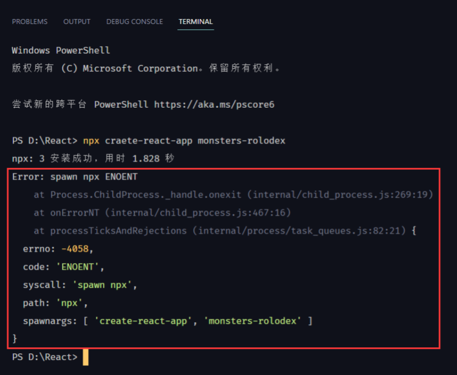

# `React Key Concepts`


复杂度更低、代码质量更好、开发时间更快

1. Don't touch the DOM. I'll do it. 不直接操作`DOM`，`React`来！
2. Build websites like lego blocks. 搭建网页像搭乐高一样。
3. Unidirectional data flow.  数据只能单向流动~
4. UI, The rest is up to you.  嘿，我只是UI，其他的由你决定……

<br />


使用相同的想法、相同的原则和相同的`Javascript`来构建桌面应用程序、VR应用程序、移动应用程序、浏览器网页等。<br />

作为一名`React`开发者

- 决定如何使用容器
- 决定状态如何管理
- 当状态改变时如何处理

# React Basics
> 踩坑日记1：
> 安装react-cli时，使用npx命令报错，如下图：
>
> 
>
> 后切换了控制台为cmd后，先执行：
> npm uninstall -g create-react-app
> 后重新安装create-react-app命令：
> npm install create-react-app
> 在cmd下，安装react-cli成功，参考[这个链接](https://www.likecs.com/ask-182785.html)。


## `npm ＆ npx`
`npx`：实际上是一个包含在`npm v5.2`及以上版本中的一个工具，`npx`可以做到直接安装某一个包所需要的文件后直接立刻执行指令，并且下载的是这个包的最新版本，安装后立刻运行，然后就立即删除。就像是需要某个东西时，在需要的时候使用，用完就扔。

```bash
npx cowsay hello
```
`npm`： 一个包管理器，既是一个安装环境（installation），也是一个可执行环境（a executable environment），所以这意味着我们可以直接安装，创建React应用和相关的包，可以安装到多个版本，也可以全局安装一个版本。当我们安装了某一个库后，想要使用它时，我们必须将它安装在磁盘的某个位置上，可能是本地项目文件夹中，也可能是我们的计算机全局。
```bash
npm i -g cowsay
npm list -g cowsay

npm uninstall -g cowsay
```

## Don't eject
[What does this "react-scripts eject" command do?](https://stackoverflow.com/questions/48308936/what-does-this-react-scripts-eject-command-do)


## `Class`
Class Components
```jsx
import logo from './logo.svg';
import './App.css';

import { Component } from 'react'

class App extends Component {
	render() {
		return (
			<div className="App">
				<header className="App-header">
					
					<p>
						Edit <code>src/App.js</code> and save to reload.
					</p>
					<a
						className="App-link"
						href="https://reactjs.org"
						target="_blank"
						rel="noopener noreferrer"
						>
						Learn React
					</a>
				</header>
			</div>
		);
	}
}

export default App;
```

### `state`
```jsx
class App extends Component {
	constructor() {
		super();
		this.state = {
			name: 'Erik Xue'
		}
	}
	
	render() {
		return (
			<div className="App">
				<header className="App-header">
					
					<p>
						// 此方式不会更新state中的属性值
						Hellllo {this.state.name}
					</p>
					<button>change name</button>
				</header>
			</div>
		);
	}
}
```

### `setState`: 浅合并
```jsx
// state
this.state = {
	name: 'Erik Xue'
}
// DOM
{this.state.name}
// funciton
this.setState({ name: 'Han Lu' });
```
如果`state`中的属性值是对象：
```jsx
// state
this.state = {
	name: {firstName: 'Erik', lastName: 'Xue'}
}
// DOM
{this.state.name.firstName} + {this.state.name.lastName}
// funciton
this.setState({ name: {firstName: 'Lu', lastName: 'Han' });
```
> 奇怪的现象：为什么当点击按钮console“name”属性时，第一次输出的是“旧值”，然后接下来才会输出“新值”？
> 
> 原因：因为setState是以异步进行的。那么更新的回调函数不一定会在第一时间就执行，所以console log时大概率输出的还是“旧值”。

那么问题来了，如果想setState后立刻拿到更新后的值怎么办呢？
```jsx
onClick={() => {
	this.setState(
		() => {
			return {
				name: { firstName: 'Lu', lastName: 'Han' }
			};
		},
		// 第二个回调函数会在第一个回调函数执行完成后调用
		() => {
			console.log(this.state.name)
		}
	)
}}
```

### Mapping Arrays to Elements
数组可以使用map遍历的方式渲染到页面上。
```jsx
// state
this.state = {
	monsters: [
		{
			name: 'Linda',
			id: 'a001'
		},
		{
			name: 'Frank',
			id: 'a002'
		},
		{
			name: 'Jacky',
			id: 'a003'
		}
	],
}
// render
render() {
	return (
		<div className="App">
			{
				this.state.monsters.map(monster => {
					return <h1 key={monster.id}>{monster.name}</h1>
				})
			}
		</div >
	);
}
```
### `className`
JSX是JS的扩展语法，实际上只是在编写时带有一些附件功能和类的JavaScript。`className`作为JSX中受保护的关键字，因为我们在写组件的时候需要用到class来extend类，基于此原因，我们在JSX中，标签如果要使用类名，要用`className`关键字，而不使用class。
```jsx
<div className="App">
</div>
```

### Optimizations(优化)

1. 初始化变量时使用ES6语法，让代码更具有可读性；
2. 将匿名函数提取到component，因为匿名函数每次调用时都会加载一次，放在外面只会在component初始化时加载一次。
```jsx
class App extends Component {
	constructor() {
		super();
		this.state = {
			monsters: [],
			searchField: ''
		}
		console.log('constructor')
	}
	
	// [2]
	onSearchChange = (event) => {
		// console.log(`event.target.value:${event.target.value}`)
		const searchField = event.target.value.toLocaleLowerCase();
		this.setState(() => {
			return { searchField }
		})
	}
	
	componentDidMount() {
		console.log('componentDidMount')
		fetch('https://jsonplaceholder.typicode.com/users')
			.then(resonse => resonse.json())
			.then(users => this.setState(
			() => {
				return { monsters: users }
			}
		))
	}
	
	render() {
		// [1]
		const { monsters, searchField } = this.state
		const { onSearchChange } = this
		
		const filterMonsters = monsters.filter(monster => {
			return monster.name.toLocaleLowerCase().includes(searchField)
		})
		return (
			<div className="App">
				<input
					className='search-box'
					type='search'
					placeholder='search monsters'
					onChange={
						// (event) => {
						//   console.log(`event.target.value:${event.target.value}`)
						//   const searchField = event.target.value.toLocaleLowerCase();
						//   this.setState(() => {
						//     return { searchField }
						//   })
						// }
						onSearchChange
					}
					/>
				{filterMonsters.map(monster => {
					return (<div key={monster.id}>
							<h1>{monster.name}</h1>
						</div>);
				})
				}
			</div >
		);
	}
}
```

### Component
每一个组件都必须有一组div标签包裹，这一点和vue相同。
```jsx
import { Component } from 'react'

class CardList extends Component {
	render() {
		return 
			<div>
				xxx
			</div>
	}
}
```
使用组件：
```jsx
import CardList from 'xxx'

<CardList />
```
组件传值：
```jsx
// 传递
<CardList monsters={filterMonsters} />

// 接收
const { monsters } = this.props
```

小问题：为什么在`CardList`组件中`console.log('rende by CardList')`在控制台会输出两遍`“render by CardList”`？<br /><br />原因在于：<br />这是因为组件re-render基于三种情况：

1. `setState`被调用时；
2. `props`更新时；
3. `forceUpdate`被调用时（不推荐）。

Component Tree(组件树)的渲染是由上而下的。

```
<App /> ---> constructor ---> render ---> <子组件 />
```

> 踩坑日记2：
> monsters项目中，当将Card组件拆分出来的之后，控制台一直报警告：
> 
> 百思不得其解，已经给Card组件中map遍历的monster设置了key，后google，发现是因为Card组件传入值时需要设置key，因此可以通过为map的回调函数设置第二个参数（index)作为key就可以解决该警告。

```jsx
// 解决前
class CardList extends Component {
	render() {
		const { monsters } = this.props
		return (
			<div className="card-list">
				{monsters.map((monster) => {
					return <Card monster={monster} />
				})}
			</div>
		)
	}
}

// 解决后
class CardList extends Component {
  render() {
    const { monsters } = this.props
    return (
      <div className="card-list">
        {monsters.map((monster, index) => {
          return <Card monster={monster} key={index} />
        })}
      </div>
    )
  }
}
```
> React使用虚拟DOM来管理何时更改了哪些DOM。然后采用一种方法，将更改反馈到实际DOM中。
> 这意味着需要知道哪些DOM已更改，因此最好的映射方法就是提供索引号和标识符。

总结

- 解决方案是将映射方法回调函数的第二个参数（index）作为`key`；
- React采用虚拟DOM方式；
- 使用虚拟DOM需要一个key来标识已更改的DOM。

## Functional Components vs Class Components

### [Class Components](https://projects.wojtekmaj.pl/react-lifecycle-methods-diagram/)

### Functional Components
```jsx
const App = () => {
	return (
		<div>
		</div>
	)
}
```
函数组件没有生命周期的概念，我们要关注的是函数组件所带来的作用和副作用。关于副作用要先了解纯函数（pure function）。

#### pure function & non-pure function
```jsx
// pure function
// 输入参数，无论调用多少次都会返回相同的结果
function pureFun(a, b) {
	return a + b
}

// non-pure function
// c是有可能变化的，如果c变化，那么调用返回的结果也会有变化
let c = 3;
function nonPureFun(a, b) {
	return a + b + c
}
```
副作用就来自函数外部依赖的变量。总而言之，如果一个函数除了使用传入的参数以外，还有依赖或使用外部的参数，那么这就不是一个纯函数。

### Hooks-`useState`
语法回顾：解构赋值
```jsx
const arr = [2, 4]
const [a, b] = arr
// a = 2, b = 4
```
_**useState(value, setValue)**_

1. `value`: 要存储的值；
2. `setValue`: 函数，设值的函数。
```jsx
import { useState } from 'react'
const App = () => {
  const [searchField, setSearchField] = useState('')  // [value, setValue]
  console.log({ searchField })

  const onSearchChange = (event) => {
    const searchFieldStr = event.target.value.toLocaleLowerCase();
    setSearchField(searchFieldStr)
  }

  return (
    <div>
    </div >
  );
}
```
React每次需要重新渲染时都会从上到下运行整个函数组件，而重新渲染的条件是React会比对初始化存储的值和接收的值是否一致，如果不一致，才进行重渲染。

### Hooks-`useEffect`
##### 副作用一
无限循环的问题：下面这段代码会导致React疯狂无限渲染，原因在于，每次fetch得到一个users对象，在setMonsters该对象时，对象的引用是不同的，也就是说每次拿到的users对象虽然对象内的内容是一样的，但是对象引用并不一样，所以就会导致React一直在重复渲染。
```jsx
const [monsters, setMonsters] = useState([])

fetch('https://jsonplaceholder.typicode.com/users')
	.then(resonse => resonse.json())
  .then((users) => setMonsters(users))
```
_**useEffect(callFunction,  array)**_

1. 回调函数，用于在函数组件内需要执行的代码；
2. 数组，依赖的值，如果数组里的值发生改变，那么就会执行回调函数。
```jsx
import { useEffect } from 'react';

useEffect(() => {
	fetch('https://jsonplaceholder.typicode.com/users')
		.then(resonse => resonse.json())
		.then((users) => setMonsters(users))
}, [])
```

##### 副作用二
举例来说，当还有另外一个state变量时，我们再新建一个SearchBox，这个SearchBox并不会用到monsters或searchField变量，但是在这个SearchBox每输入一个字符，都会执行过滤monsters，这就会导致效率低下，而我们期望的是只有在和过滤monsters相关的事情时再过滤这些monsters。
```jsx
const [anotherSearchStr, setAnotherSearchStr] = useState('')

const anotherSearchStrChange = (event) => {
	setAnotherSearchStr(event.target.value)
}

const filterMonsters = monsters.filter(monster => {
	return monster.name.toLocaleLowerCase().includes(searchField)
})

console.log(filterMonsters)
```


<br />解决此副作用的方法<br />还是使用`useEffect`方法，再设置一个`useState`，用于接收过滤后的monster，然后用useEffect把filter包起来，并监视monsters和searchField。

```jsx
const [filterMonsters, setFilterMonsters] = useState(monsters)

useEffect(() => {
	const newFilterMonsters = monsters.filter(monster => {
		return monster.name.toLocaleLowerCase().includes(searchField)
	})
	setFilterMonsters(newFilterMonsters)
}, [monsters, searchField])
```

##### 函数组件传值
```jsx
// props 用于接收传递的参数
const Card = (props, forwardRef) => {}
```

## 性能优化
原则是如果没有性能问题，就不要进行过度优化，只有当出现性能问题时，着手进行优化。

### Hooks-`useCallback`
react遇到这个钩子的时候，如果依赖的数组中的任何值发生变化，才会重新执行`useCallback`中的回调函数，callback中的函数会记忆化。<br />这里需要注意的是，useCallback中的回调函数的值会在初始化后一直记忆，如果想要根据回调函数中的值的变化重新渲染执行函数，那么一定要将依赖的值放在依赖数组中。
```jsx
const goToCheckHandler = useCallback(() => {

}, [])
```

### Hooks-`useMemo`
```jsx
useMemo(() => {}, [])
```

### `Suspense & Lazy`
```jsx
import { lazy, Suspense } from 'react'

const Shop = lazy(() => import('./routes/shop/shop.component'))
const Checkout = lazy(() => import(''))
...

const App = () => {
	...
	
	return (
		<Suspense fallback={}>
			...
		</Suspense>
	)
}
```

### React v17&v18
```jsx
// index.js
ReactDOM.render(
	<React.StrictMode>
		<App />
	</React.StrictMode>
	document.getElementById('root')
);
```
```jsx
// index.js
const root = ReactDOM.createRoot(document.getElementById('root'));
root.render(
  <React.StrictMode>
    <App />
  </React.StrictMode>
);
```
v18版本中严格模式下（StrictMode）React是双重渲染（double render），以便它可以捕捉到任何可能发生的奇怪行为以及在函数组件中的副作用。

### Real DOM & Virtual DOM
<br /><br /><br /><br /><br /><br />


#### React & ReactDOM
```html
<!DOCTYPE html>
<html lang="en">
	<head>
		<meta charset="UTF-8" />
		<meta http-equiv="X-UA-Compatible" content="IE=edge" />
		<meta name="viewport" content="width=device-width, initial-scale=1.0" />
		<title>Document</title>
	</head>
	<body>
		<div id="root">React is NOT rendered</div>
		<script src="https://unpkg.com/react@18.0.0-rc.0/umd/react.development.js"></script>
		<script src="https://unpkg.com/react-dom@18.0.0-rc.0/umd/react-dom.development.js"></script>
		<script>
			const Person = (props) => {
				return React.createElement('div', {}, [
					React.createElement('h1', { key: 1 }, props.name),
					React.createElement('p', { key: 2 }, props.occupation),
				])
			}
			
			const App = () => {
				return React.createElement('div', {}, [
					React.createElement('h1', { className: 'fuck', key: 3 }, 'React IS rendered'),
					React.createElement(Person, { name: 'Erik', occupation: 'IT', key: 4 }, null),
					React.createElement(Person, { name: 'Xue Yukun', occupation: 'engineer', key: 5 }, null),
					React.createElement(Person, { name: 'Crazypokerk', occupation: 'Geeks', key: 6 }, null),
				])
			}
			
			// ReactDOM.render(React.createElement(App), document.getElementById('root'))
			
			const container = document.getElementById('root')
			const root = ReactDOM.createRoot(container)
			root.render(React.createElement(App))
		</script>
	</body>
</html>

```

#### DOM Paint Flashing
<br />绿色的闪烁可以反映出一个组件如何重新渲染以及渲染了哪些组件，反过来，DOM树上的哪些反射节点要重绘(repaint)。

## Routing
### 添加Router-dom
```bash
npm add react-router-dom@6
```

### 设置路由
```jsx
import { BrowserRouter } from 'react-router-dom'

const root = ReactDOM.createRoot(document.getElementById('root'));
root.render(
	<React.StrictMode>
		<BrowserRouter>
			<App />
		</BrowserRouter>
	</React.StrictMode>
);
```
`path`: 设置跳转的相对路径；<br />`elemen`t: 渲染的组件；

```jsx
import { Routes, Route } from 'react-router-dom';

const App = () => {
  return (
    <Routes>
      <Route path='/fuck' element={<Home />}></Route>
    </Routes>
  )
}
```

1. \<Routes>
2. \<Route>
3. \<Outlet>
4. \<Fragment>
   1. 使用Fragment容器的原因是因为React的规则，我们的组件必须拥有父级节点，一个包含组件的顶级父级节点。在在 React 项目中， render 方法只能有一个根元素，一般都是 `<div> </div>` ，然后在里面写上我们的组件，渲染到浏览器一看，除了我们想要显示的内容，外面还套着一层 div ，如果在写项目的时候，套了很多曾组件，那么每一层都会多出来一个父级元素 div ，不美观，而且在调整样式的时候会有些麻烦。在引入 React 的时候，增加一个属性 Fragment ，然后 render()方法下唯一的根元素我们用` <Fragment> </Fragment> `来代替。
5. \<Link>
### React context
### `context`的使用方法
1、新建一个`content`组件，引入 `{ createContext }`<br />


```jsx
import { createContext, useState } from 'react'

// as the actual value you want to access
export const UserContext = createContext({
	currentUser: null,
	setCurrentUser: () => null,
})

export const UserProvider = ({ children }) => {
	const [currentUser, setCurrentUser] = useState(null)
	const value = { currentUser, setCurrentUser }
	return <UserContext.Provider value={value}>{children}</UserContext.Provider>
}
```
2、在需要该context的组件中引入context组件及 { useContext }
```jsx
import { useState } from 'react'
import { UserContext } from '../../contexts/user.context'

// 解构赋值取出context中保存到对象的值
const { currentUser } = useContext(UserContext)
const { setCurrentUser } = useContext(UserContext)
```


### 两个需要记住的点

1. 为什么要创建设置实用函数（utility functions），因为我们想尽可能减少第三方库对我们代码的影响；
2. 在`useEffect`中使用异步函数，我们想在回调函数中创建自己的新的异步函数，目的是为了在该函数初始化后在同一个回调中调用。
```jsx
// getCategoriesAndDocuments()
export const getCategoriesAndDocuments = async () => {
	const collectionRef = collection(db, 'categories')
	const q = query(collectionRef)
	
	const querySnapshot = await getDocs(q)
	const categoryMap = querySnapshot.docs.reduce((acc, docSnapshot) => {
		const { title, items } = docSnapshot.data()
		acc[title.toLowerCase()] = items
		return acc
	}, {})
	
	return categoryMap
}

useEffect(() => {
	const getCategoriesMap = async () => {
		const categoryMap = await getCategoriesAndDocuments()
		console.log(categoryMap)
	}
	getCategoriesMap()
}, [])
```

箭头函数单行返回/多行返回

1. 单行返回：() => (xxx)
2. 多行返回：() => {xxx}
### Hooks-`useParams`
作用：用于取到Route标签中path路径中的值。
```jsx
return (
	<Routes>
		<Route index element={<CategoriesPreview />}></Route>
		<Route path=":category" element={<Category />}></Route>
	</Routes>
)
```
```jsx
import { useParams } from 'react-router-dom'

const { category } = useParams()
```
在浏览器路径上：


<br />

## CSS样式冲突问题
在P116集设置好后，可以发现样式有冲突，导致shop和index页面样式不正常，视频中先后给出了两种解决方式。<br />1、修改CSS中class类名，使得冲突的类名不重复，此方式可以解决，但还是有未知的类名冲突会导致样式不正确；<br />2、使用[styled components](https://styled-components.com/)类库，该类库通过特别语法可以为每一个标签设置一个随机的类名。<br />
```jsx
import styled from 'styled-components'

import { Link } from 'react-router-dom'

export const NavigationContainer = styled.div`
  height: 70px;
  width: 100%;
  display: flex;
  justify-content: space-between;
  margin-bottom: 25px;
`
export const LogoContainer = styled(Link)`
  height: 100%;
  width: 70px;
  padding: 25px;
`
export const NavLinks = styled.div`
  width: 50%;
  height: 100%;
  display: flex;
  align-items: center;
  justify-content: flex-end;
`

export const NavLink = styled(Link)`
  padding: 10px 15px;
  cursor: pointer;
`
```
```jsx
return (
	<Fragment>
		<NavigationContainer>
			<LogoContainer to="/">
				<CrwnLogo className="logo" />
			</LogoContainer>
			<NavLinks>
				<NavLink to="/shop">SHOP</NavLink>
				{currentUser ? (
					// as关键字可以替换设置的标签
					<NavLink as="span" onClick={signUserOut}>
						SIGN OUT
					</NavLink>
				) : (
					<NavLink to="/auth">SIGN IN</NavLink>
				)}
				<CartIcon />
			</NavLinks>
			{isCartOpen && <CartDropDown />}
		</NavigationContainer>
		<Outlet />
	</Fragment>
)
```

### styles components嵌套
可以在样式组件内定位不同的其他样式组件作为选择器，如下代码为在CartDropDown样式组件中嵌套使用了Button的样式。
```jsx
export const CartDropdownContainer = styled.div`
  position: absolute;
  width: 240px;
  height: 340px;
  display: flex;
  flex-direction: column;
  padding: 20px;
  border: 1px solid black;
  background-color: white;
  top: 90px;
  right: 40px;
  z-index: 5;

  ${BaseButton},${GoogleSignInButton},${InvertedButton} {
    margin-top: auto;
  }
`
```

### styles components传递props
styles components可以像jsx一样书写JavaScript代码，当然也可以用props向样式组件里传递参数，同样的，在样式组件里取该参数使用即可。

### styles components考虑组件的声明顺序
如果要将scss样式转换为样式组件，那么在声明组件标签时，要考虑标签渲染顺序，比如如下。
```jsx
import styled from 'styled-components'

// 因为在directory-item-container中要使用backgroundImage，所以要先声明backgroundImage的样式
export const BackgroudImage = styled.div`
  width: 100%;
  height: 100%;
  background-size: cover;
  background-position: center;
  background-image: ${(props) => `url(${props.imageUrl})`};
`
export const Body = styled.div`
  height: 90px;
  padding: 0 25px;
  display: flex;
  flex-direction: column;
  align-items: center;
  justify-content: center;
  border: 1px solid black;
  background-color: white;
  opacity: 0.7;
  position: absolute;

  h2 {
    font-weight: bold;
    margin: 0 6px 0;
    font-size: 22px;
    color: #4a4a4a;
    text-transform: uppercase;
  }

  p {
    font-weight: lighter;
    font-size: 16px;
  }
`

export const DirectoryItemContainer = styled.div`
  min-width: 30%;
  height: 240px;
  flex: 1 1 auto;
  display: flex;
  align-items: center;
  justify-content: center;
  border: 1px solid black;
  margin: 0 7.5px 15px;
  overflow: hidden;

  &:hover {
    cursor: pointer;

    & .background-image {
      transform: scale(1.1)
      transition: transform 6s cubic-bezier(0.25, 0.45, 0.45, 0.95);
    }

    & .category-body-container {
      opacity: 0.9;
    }
    &:first-child {
      margin-right: 7.5px;
    }

    &:last-child {
      margin-left: 7.5px;
    }
`
```

### Hooks-`useNavigate`
类似于Link标签的功能，可以实现页面导航的效果。
```jsx
import { useNavigate } from 'react-router-dom'

const navigate = useNavigate()

// route为想跳转的路径
navigate(route)
```

## [Netlify](https://www.netlify.com/)
一款在线打包部署的网站，可以提供链接github仓库直接打包部署项目。

### 建立站点
### 错误
部署完成后，访问对应的站点，当到达mens路径页面时，如果刷新页面，会报如下错误。<br /><br />原因是我们的应用是单页面应用，在第一次访问应用时，服务器就将所有的资源发送了过来。当刷新页面时，浏览器会重新请求https://xxx.com/shop/mens，但是我们在该路径下没有对应的资源，所以报错。


### 解决办法
在项目public文件夹下，创建一个 _redirects 文件，表示如果收到任何root请求，都重定向到另外一个路径下，也就是/index.htm，并返回状态码200。

<br />


# Redux
回忆一下之前的Context~React Context API<br />而Redux是一个外部库，和React Context API非常相似，提供的功能也类似。


## Reducers
老概念：React Context API<br />新概念：Reducers<br />

## Redux vs Context
### Context
Context具有隔离性，通过Context，我们能够包装应用程序具有隔离可访问的空间。<br />
### Redux
<br />
#### RudexHooks-`useDispatch`
#### RudexHooks-`useSelector`
### Curyy柯里化
```jsx
const curryFuc = (a) => (b, c) => {
  a + b - c 
}

const with3 = curryFuc(3)
const with10 = curryFun(10)
with10(9, 2)
with3(2, 4)
```
