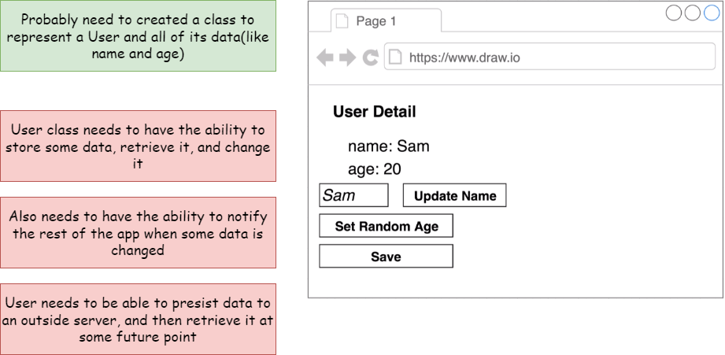
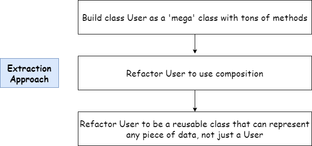
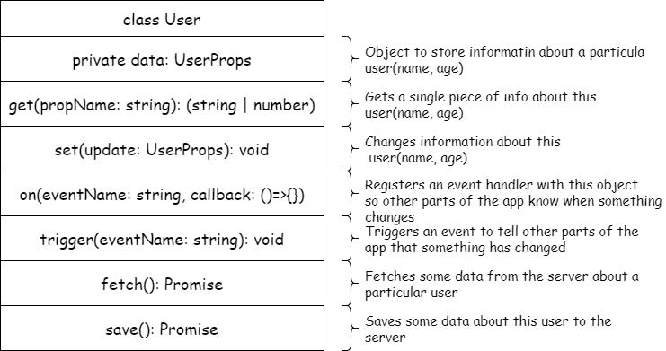
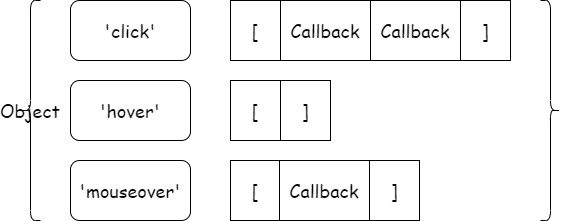
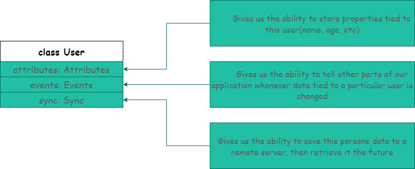
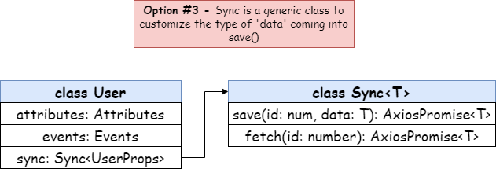
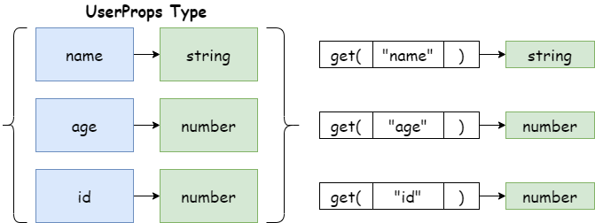
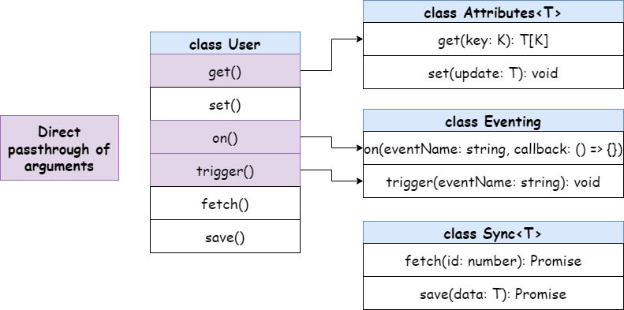
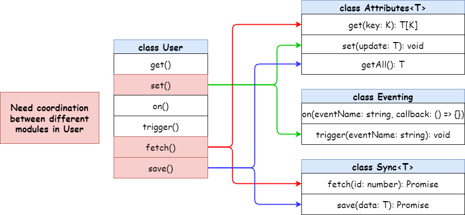

# Build a Web Framework!

### 环境准备

我们的目的是建立一个小型的 web 框架，一步一步对代码进行重构和优化，从而达到框架的效果及做到代码的复用。



安装 parcel

```bash
npm install -g parcel-bundler
```

启动 parcel

```bash
parcel [filename.html]
```



### 工程结构

```
.
├─ .cache
├─ dist
├─ node_modules
├─ src
│  ├─ models
│  ├─ ├─ User.ts
│  └─ index.ts
├─ db.json
├─ index.html
├─ package-lock.json
├─ package.json
├─ yarn-error.log
└─ yarn.lock
```

## 建立基础类

### 基础类

- Mode Classes: Handle data, used to represent Users, Blog Posts, Images, ect.
- View Classes: Handle HTML and events caused by the user(like clicks)

### 安装 JSON server

**JSON Server**是一个可以提供前端接口功能的工具包。只需指定一个`json`文件作为接口的数据源即可，在本例中，我们的 json 文件是`db.json`。

1、添加 npm 包

```bash
npm install -g json-server
```

2、创建 db.json 文件

```json
{
  "users": []
}
```

3、启动 JSON server

```bash
json-server -w db.json
```

4、安装 axios

```bash
npm install axios
```

5、命令简写配置

因为以上为了启动 json server，又要使用 parcel，那么就不得不打开两个命令行窗口，分别启动对应的服务，并且这两个命令的长度也很长，不容易记忆。为了解决此问题，可以在 `package.json` 中配置启动脚本。

```json
{
  "devDependencies": {
    "typescript": "^4.7.4"
  },
  "dependencies": {
    "axios": "^0.27.2"
  },
  "scripts": {
    // "自定义脚本": "原脚本"
    "start:db": "json-server -w db.json",
    "start:parcel": "parcel index.html"
  }
}
```

### User 类



其中，`on()` 函数的目的是将事件添加到 `events` 对象中，该对象的键是事件名称，值是回调函数数组。



User.ts

```typescript
import axios, { AxiosResponse } from 'axios'

interface UserProps {
  id?: number
  name?: string
  age?: number
}

type Callback = () => void

export class User {
  // 变量名: 类型是一个对象{ [键: 类型]: 值 } = 初始化为空对象{}
  events: { [key: string]: Callback[] } = {}

  constructor(private data: UserProps) {}

  get(propsName: string): string | number {
    return this.data[propsName]
  }

  set(update: UserProps): void {
    Object.assign(this.data, update)
  }

  on(eventName: string, callback: Callback): void {
    const handlers = this.events[eventName] || []
    handlers.push(callback)
    this.events[eventName] = handlers
  }

  trigger(eventName: string): void {
    const handlers = this.events[eventName]
    if (!handlers || !handlers.length) return
    handlers.forEach((callback) => callback())
  }

  fetch(): void {
    axios.get(`http://localhost:3000/users/${this.get('id')}`).then((response: AxiosResponse): void => {
      this.set(response.data)
    })
  }

  save(): void {
    const id = this.data.id
    if (id) {
      axios.put(`http://localhost:3000/users/${id}`, this.data)
    } else {
      axios.post('http://localhost:3000/users', this.data)
    }
  }
}
```

以上就是第一版的`User`类，当然接下来我们也对代码进行重构，让代码更加可复用。

## 组合（Composition）重构

先来看一下我们要重构后的结构：



可以看到，我们的`User`类不再有各种参数和方法，都以组合的方式分布在其他类中。

### 提取 Eventing 类

首先，我们将`User`类中和事件相关的类和属性提取到`Eventing`类中。

Eventing.ts

```typescript
type Callback = () => void

export class Eventing {
  // 变量名: 类型是一个对象{ [键: 类型]: 值 } = 初始化为空对象{}
  events: { [key: string]: Callback[] } = {}

  on(eventName: string, callback: Callback): void {
    const handlers = this.events[eventName] || []
    handlers.push(callback)
    this.events[eventName] = handlers
  }

  trigger(eventName: string): void {
    const handlers = this.events[eventName]
    if (!handlers || !handlers.length) return
    handlers.forEach((callback) => callback())
  }
}
```

接下来我们有三种方式构建 User 对象。

Option #1 Accept dependencies as second constructor argument

在`User`的构造函数中传入第二个参数`events` 。

```typescript
class User {
  constructor(private data: UserProps, private events: Eventing) {}
}

// 构建 User
const user = new User({}, new Eventing())
```

Option #2 Only accept dependencies into constructor. Define a static class method to preconfigure. User and assign properties afterwards.

```typescript
class User {
  static fromData(data: UserProps): User {
    const user = new User(new Eventing())
    user.set(data)
    return user
  }
  private data: UserProps

  constructor(private events: Eventing) {}
}
```

Option #3 Only accept properties into constructor. Hard code dependencies as class properties.

```typescript
class User {
  public events: Eventing = new Eventing()
  constructor(private data: UserProps) {}
}
```

以上三种不同的选择，目前都是说明如何将这些提取的类集成到一个中心类`(User class)`。

作为最佳的方法，我们会选择第三种，

### 提取 Sync 类



sync.ts

```typescript
import axios, { AxiosPromise } from 'axios'

type HasId = {
  id?: number
}

export class Sync<T extends HasId> {
  constructor(public rootUrl: string) {}
  fetch(id: number): AxiosPromise {
    return axios.get(`${this.rootUrl}/${id}`)
  }

  save(data: T): AxiosPromise {
    const { id } = data
    if (id) {
      return axios.put(`${this.rootUrl}/${id}`, data)
    } else {
      return axios.post(this.rootUrl, data)
    }
  }
}
```

为了解决 Sync 中 `save()`方法中的传入参数 `data`的值类型问题，我们需要借助泛型的帮助，如果不使用泛型，那么对于每一个`data`数据类型我们都要作判断。

### 提取 Attrbutes 类

#### 两个重要原则

原则 1：在 JavaScript 中，当我们声明一个对象时，可以对象设置`key`和`value`，如下：

```javascript
const cloth = {
  color: 'red',
}
// 添加一对 key / value
cloth[5] = 'dry'
// {5: 'dry', color: 'red'}
cloth['5']
// 'dry'
```

虽然我们在设置键时，输入的是一个数字，但是可以看到，其实`key`的类型还是`string`类型的。

原则 2：在 TypeScript 中，`type`类型可以是一个字符串。

```
type Test = 'abc'
```

基于以上两种原则，我们在重构`Attributes`类时，因为我们是不知道`data`的类型以及`data`类型中`key`值的类型。



如上图，每次`data`的传值不会每次都是`UserProps`类型，并且该类型中的属性名的类型，比如`name`也不会提前知道是`string`类型。

为了解决这个问题，我们又一次要使用泛型来解决。

先看一下重构后的`Attributes`类：

Attributes.ts

```typescript
export class Attributes<T> {
  constructor(private data: T) {}
  // K extends keyof T 表示 K 的类型是 T 中的key
  // 比如传入的 T 是 UserProps，那么 K 可以取到的值就是 'name', 'age', 'id'这三个字符串
  // 那么 T[K] 的值对应的分别就是：string, number, age
  get<K extends keyof T>(key: K): T[K] {
    return this.data[key]
  }

  set(update: T): void {
    Object.assign(this.data, update)
  }
}
```

new 一个对象来看看。

```typescript
const attr = new Attributes({
  a: 'b',
  b: 123,
  c: true,
})

const a = attr.get('a') // typeof(a) === 'string'
const b = attr.get('a') // typeof(b) === 'number'
const c = attr.get('a') // typeof(c) === 'boolean'
```

完美，这样就解决了传入的`data` 的类型及类型属性值的类型解析问题，并且也限制了传入参数的类型(extends T)，在 T 中查找给定的键，以了解我们返回的值的类型。

## 组合—委托

### get() on() trigger()

一切准备就绪，我们来试试重构后的`User`对象。

```typescript
const user = new User({
  id: 3,
  name: 'Erik',
  age: 18,
})

const newUser = {
  id: user.attributes.get('id'),
  name: user.attributes.get('name'),
  age: user.attributes.get('age'),
}

console.log(newUser)
// {id: 3, name: 'Erik', age: 18}
```

是不是好麻烦？要拿到传入的对象，我们必须取到对应的值，然后在自行组合成对象才可以继续使用。

那么，为了解决这个问题，我们此时就可以用到**委托**的思维。

我们可以直接通过传递参数的形式，在`User`类上设置方法，调用对应类中的方法。



为了实现上图效果，我们可以给`User`类中的方法添加`get`关键字。

```typescript
class User {
  get on() {
    return this.events.on
  }

  get trigger() {
    return this.events.trigger
  }

  get get() {
    return this.attributes.get
  }
}
```

好了，改造完成后，我们测试一下：

```typescript
const user = new User({
  id: 3,
  name: 'Erik',
  age: 18,
})

user.on('change', () => {
  console.log('change it!')
})

user.trigger('change')

user.get('name')

// change it!
// Attributes.ts:8
//  Uncaught TypeError: Cannot read properties of undefined (reading 'name')
//  at User.get (Attributes.ts:8:12)
//  at parcelRequire.src/index.ts../models/User (index.ts:63:6)
//  at newRequire (src.f10117fe.js:47:24)
//  at src.f10117fe.js:81:7
//  at src.f10117fe.js:120:3
```

oops~!!! 怎么报错了？我们先来回顾一下`JavaScript`中的`this`。

#### `this` 丢失

```javascript
const colors = {
  color: 'red',
  printColor() {
    console.log(this.color)
  },
}

const printC = colors.printColor
printC()
// undefined
```

上面代码为什么会输出`undefined`呢？因为`this`已经丢失，不再是`colors.printColor()`，而是`undefined.printColor()`。

#### 解决办法

将普通函数改为箭头函数，以绑定`this`的指向就可以啦。

```typescript
// Attributes.ts
get = <K extends keyof T>(key: K): T[K] => {
  return this.data[key]
}

// Eventing.ts
on = (eventName: string, callback: Callback): void => {
  const handlers = this.events[eventName] || []
  handlers.push(callback)
  this.events[eventName] = handlers
}

trigger = (eventName: string): void => {
  const handlers = this.events[eventName]
  if (!handlers || !handlers.length) return
  handlers.forEach((callback) => callback())
}
```

至于为什么`on`和`trigger`没有发生`this`丢失的问题，完全是偶然，因为传入的参数存储到了`Eventing`对象中的`events`属性中。

### set() fetch() save()

接下来以不同模块合作的方式实现剩下的三个委托方法。



#### set()

```typescript
class User {
  set(update: UserProps) {
    this.attributes.set(update)
    this.events.trigger('change')
  }
}
```

当调用`set()`方法时，先更新新的数据，然后触发`change`事件。

```typescript
const user = new User({
  id: 711,
  name: '便利店',
  age: 555,
})

user.on('change', () => {
  console.log(`user info has been changed!!!`)
})

console.log(user.attributes)

setTimeout(() => {
  user.set({
    name: '万象汇-便利店',
    age: 666,
  })
  console.log(user.attributes)
}, 2000)

// data: {id: 711, name: '便利店', age: 555}
// user info has been changed!!!
// data: {id: 711, name: '万象汇-便利店', age: 666}
```

#### fetch()

`fetch`方法来源于`Sync`类，所以思路是我们先获取`id`，然后根据`id`拿到对应的对象值。该方法目的是为了拿到`JSON`数据源中的数据对象。

```typescript
class User {
  fetch(): void {
    const id = this.attributes.get('id')
    if (typeof id !== 'number') {
      throw new Error('Cannot fetch without an id')
    }
    this.sync.fetch(id).then((response: AxiosResponse) => {
      this.set(response.data)
    })
  }
}
```

测试一下：

```typescript
const user = new User({ id: 2 })
user.on('change', () => {
  console.log(user.attributes)
})

user.fetch()
// data: {id: 2, name: 'postUser', age: 888}
```

#### save()

`save`方法也来源于`Sync`类，思路是调用`attributes`中的`getAll()`方法获得最新的对象，然后调用保存方法将数据存入`JSON`数据中。

为了配合`save`方法，我们在`Attributes`类中加了一个方法`getAll()`以获取当前对象。

```typescript
class Attributes {
  getAll(): T {
    return this.data
  }
}
```

```typescript
class User {
  save(): void {
    const newAttr = this.attributes.getAll()
    this.sync
      .save(newAttr)
      .then((response: AxiosResponse) => {
        this.trigger('save')
      })
      .catch((error) => {
        throw new Error(error)
      })
  }
}
```

测试一下：

```typescript
const user = new User({
  name: '葡萄城',
  age: 32,
})

user.on('save', () => {
  console.log('user info is saving...')
})

user.save()
```
