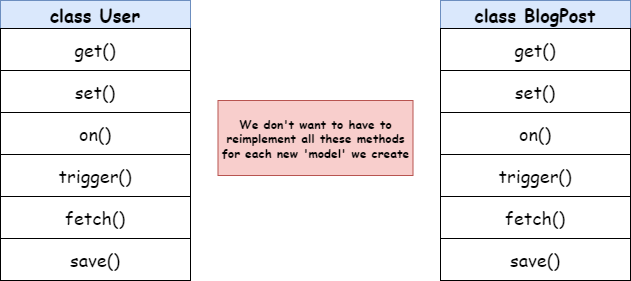
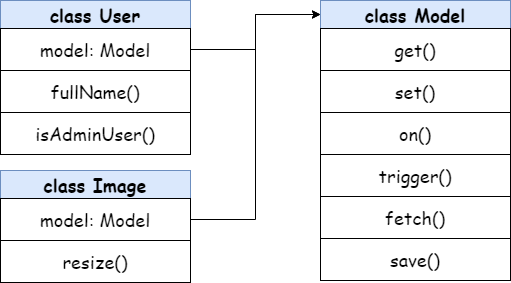
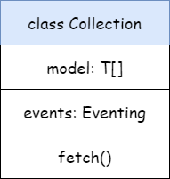
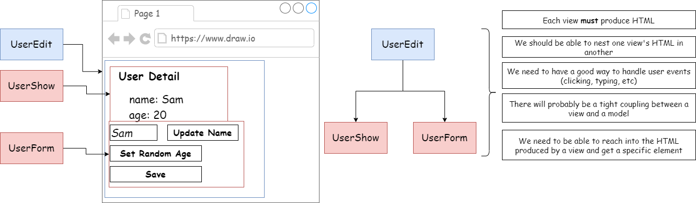
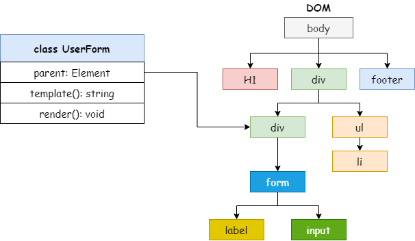
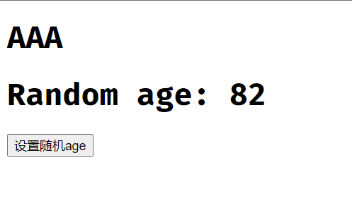
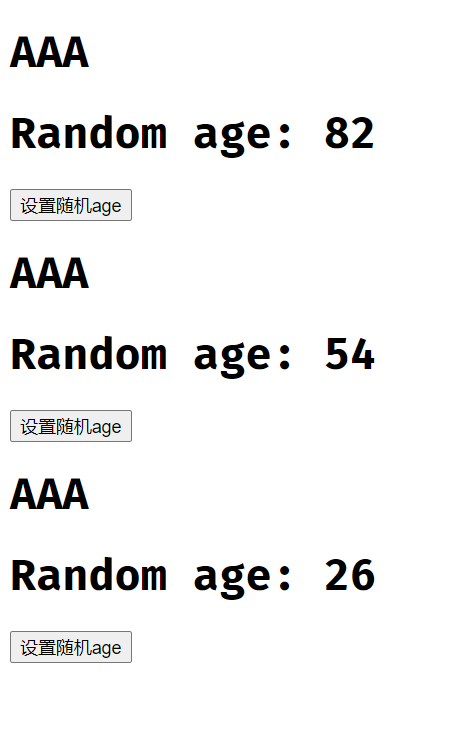
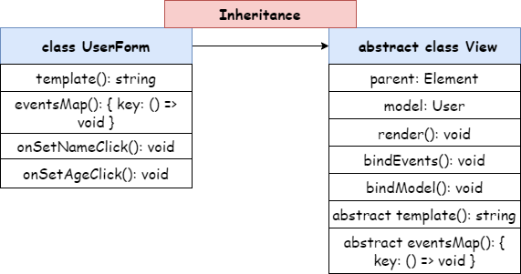
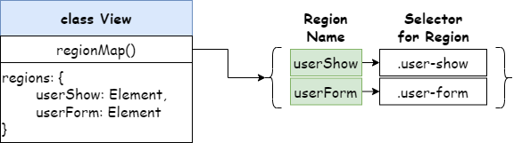

# Build a Web Framework!

### 环境准备

我们的目的是建立一个小型的 web 框架，一步一步对代码进行重构和优化，从而达到框架的效果及做到代码的复用。


安装 parcel

```bash
npm install -g parcel-bundler
```

启动 parcel

```bash
parcel [filename.html]
```


### 工程结构

```
.
├─ .cache
├─ dist
├─ node_modules
├─ src
│  ├─ models
│  ├─ ├─ User.ts
│  └─ index.ts
├─ db.json
├─ index.html
├─ package-lock.json
├─ package.json
├─ yarn-error.log
└─ yarn.lock
```

## 建立基础类

### 基础类

- Mode Classes: Handle data, used to represent Users, Blog Posts, Images, ect.
- View Classes: Handle HTML and events caused by the user(like clicks)

### 安装 JSON server

**JSON Server**是一个可以提供前端接口功能的工具包。只需指定一个`json`文件作为接口的数据源即可，在本例中，我们的 json 文件是`db.json`。

1、添加 npm 包

```bash
npm install -g json-server
```

2、创建 db.json 文件

```json
{
  "users": []
}
```

3、启动 JSON server

```bash
json-server -w db.json
```

4、安装 axios

```bash
npm install axios
```

5、命令简写配置

因为以上为了启动 json server，又要使用 parcel，那么就不得不打开两个命令行窗口，分别启动对应的服务，并且这两个命令的长度也很长，不容易记忆。为了解决此问题，可以在 `package.json` 中配置启动脚本。

```json
{
  "devDependencies": {
    "typescript": "^4.7.4"
  },
  "dependencies": {
    "axios": "^0.27.2"
  },
  "scripts": {
    // "自定义脚本": "原脚本"
    "start:db": "json-server -w db.json",
    "start:parcel": "parcel index.html"
  }
}
```

### User 类


其中，`on()` 函数的目的是将事件添加到 `events` 对象中，该对象的键是事件名称，值是回调函数数组。


User.ts

```typescript
import axios, { AxiosResponse } from 'axios'

interface UserProps {
  id?: number
  name?: string
  age?: number
}

type Callback = () => void

export class User {
  // 变量名: 类型是一个对象{ [键: 类型]: 值 } = 初始化为空对象{}
  events: { [key: string]: Callback[] } = {}

  constructor(private data: UserProps) {}

  get(propsName: string): string | number {
    return this.data[propsName]
  }

  set(update: UserProps): void {
    Object.assign(this.data, update)
  }

  on(eventName: string, callback: Callback): void {
    const handlers = this.events[eventName] || []
    handlers.push(callback)
    this.events[eventName] = handlers
  }

  trigger(eventName: string): void {
    const handlers = this.events[eventName]
    if (!handlers || !handlers.length) return
    handlers.forEach((callback) => callback())
  }

  fetch(): void {
    axios.get(`http://localhost:3000/users/${this.get('id')}`).then((response: AxiosResponse): void => {
      this.set(response.data)
    })
  }

  save(): void {
    const id = this.data.id
    if (id) {
      axios.put(`http://localhost:3000/users/${id}`, this.data)
    } else {
      axios.post('http://localhost:3000/users', this.data)
    }
  }
}
```

以上就是第一版的`User`类，当然接下来我们也对代码进行重构，让代码更加可复用。

## 组合（Composition）重构

先来看一下我们要重构后的结构：


可以看到，我们的`User`类不再有各种参数和方法，都以组合的方式分布在其他类中。

### 提取 Eventing 类

首先，我们将`User`类中和事件相关的类和属性提取到`Eventing`类中。

Eventing.ts

```typescript
type Callback = () => void

export class Eventing {
  // 变量名: 类型是一个对象{ [键: 类型]: 值 } = 初始化为空对象{}
  events: { [key: string]: Callback[] } = {}

  on(eventName: string, callback: Callback): void {
    const handlers = this.events[eventName] || []
    handlers.push(callback)
    this.events[eventName] = handlers
  }

  trigger(eventName: string): void {
    const handlers = this.events[eventName]
    if (!handlers || !handlers.length) return
    handlers.forEach((callback) => callback())
  }
}
```

接下来我们有三种方式构建 User 对象。

Option #1 Accept dependencies as second constructor argument

在`User`的构造函数中传入第二个参数`events` 。

```typescript
class User {
  constructor(private data: UserProps, private events: Eventing) {}
}

// 构建 User
const user = new User({}, new Eventing())
```

Option #2 Only accept dependencies into constructor. Define a static class method to preconfigure. User and assign properties afterwards.

```typescript
class User {
  static fromData(data: UserProps): User {
    const user = new User(new Eventing())
    user.set(data)
    return user
  }
  private data: UserProps

  constructor(private events: Eventing) {}
}
```

Option #3 Only accept properties into constructor. Hard code dependencies as class properties.

```typescript
class User {
  public events: Eventing = new Eventing()
  constructor(private data: UserProps) {}
}
```

以上三种不同的选择，目前都是说明如何将这些提取的类集成到一个中心类`(User class)`。

作为最佳的方法，我们会选择第三种，

### 提取 Sync 类


sync.ts

```typescript
import axios, { AxiosPromise } from 'axios'

type HasId = {
  id?: number
}

export class Sync<T extends HasId> {
  constructor(public rootUrl: string) {}
  fetch(id: number): AxiosPromise {
    return axios.get(`${this.rootUrl}/${id}`)
  }

  save(data: T): AxiosPromise {
    const { id } = data
    if (id) {
      return axios.put(`${this.rootUrl}/${id}`, data)
    } else {
      return axios.post(this.rootUrl, data)
    }
  }
}
```

为了解决 Sync 中 `save()`方法中的传入参数 `data`的值类型问题，我们需要借助泛型的帮助，如果不使用泛型，那么对于每一个`data`数据类型我们都要作判断。

### 提取 Attrbutes 类

#### 两个重要原则

原则 1：在 JavaScript 中，当我们声明一个对象时，可以对象设置`key`和`value`，如下：

```javascript
const cloth = {
  color: 'red',
}
// 添加一对 key / value
cloth[5] = 'dry'
// {5: 'dry', color: 'red'}
cloth['5']
// 'dry'
```

虽然我们在设置键时，输入的是一个数字，但是可以看到，其实`key`的类型还是`string`类型的。

原则 2：在 TypeScript 中，`type`类型可以是一个字符串。

```
type Test = 'abc'
```

基于以上两种原则，我们在重构`Attributes`类时，因为我们是不知道`data`的类型以及`data`类型中`key`值的类型。


如上图，每次`data`的传值不会每次都是`UserProps`类型，并且该类型中的属性名的类型，比如`name`也不会提前知道是`string`类型。

为了解决这个问题，我们又一次要使用泛型来解决。

先看一下重构后的`Attributes`类：

Attributes.ts

```typescript
export class Attributes<T> {
  constructor(private data: T) {}
  // K extends keyof T 表示 K 的类型是 T 中的key
  // 比如传入的 T 是 UserProps，那么 K 可以取到的值就是 'name', 'age', 'id'这三个字符串
  // 那么 T[K] 的值对应的分别就是：string, number, age
  get<K extends keyof T>(key: K): T[K] {
    return this.data[key]
  }

  set(update: T): void {
    Object.assign(this.data, update)
  }
}
```

new 一个对象来看看。

```typescript
const attr = new Attributes({
  a: 'b',
  b: 123,
  c: true,
})

const a = attr.get('a') // typeof(a) === 'string'
const b = attr.get('a') // typeof(b) === 'number'
const c = attr.get('a') // typeof(c) === 'boolean'
```

完美，这样就解决了传入的`data` 的类型及类型属性值的类型解析问题，并且也限制了传入参数的类型(extends T)，在 T 中查找给定的键，以了解我们返回的值的类型。

## 组合—委托

### get() on() trigger()

一切准备就绪，我们来试试重构后的`User`对象。

```typescript
const user = new User({
  id: 3,
  name: 'Erik',
  age: 18,
})

const newUser = {
  id: user.attributes.get('id'),
  name: user.attributes.get('name'),
  age: user.attributes.get('age'),
}

console.log(newUser)
// {id: 3, name: 'Erik', age: 18}
```

是不是好麻烦？要拿到传入的对象，我们必须取到对应的值，然后在自行组合成对象才可以继续使用。

那么，为了解决这个问题，我们此时就可以用到**委托**的思维。

我们可以直接通过传递参数的形式，在`User`类上设置方法，调用对应类中的方法。


为了实现上图效果，我们可以给`User`类中的方法添加`get`关键字。

```typescript
class User {
  get on() {
    return this.events.on
  }

  get trigger() {
    return this.events.trigger
  }

  get get() {
    return this.attributes.get
  }
}
```

好了，改造完成后，我们测试一下：

```typescript
const user = new User({
  id: 3,
  name: 'Erik',
  age: 18,
})

user.on('change', () => {
  console.log('change it!')
})

user.trigger('change')

user.get('name')

// change it!
// Attributes.ts:8
//  Uncaught TypeError: Cannot read properties of undefined (reading 'name')
//  at User.get (Attributes.ts:8:12)
//  at parcelRequire.src/index.ts../models/User (index.ts:63:6)
//  at newRequire (src.f10117fe.js:47:24)
//  at src.f10117fe.js:81:7
//  at src.f10117fe.js:120:3
```

oops~!!! 怎么报错了？我们先来回顾一下`JavaScript`中的`this`。

#### `this` 丢失

```javascript
const colors = {
  color: 'red',
  printColor() {
    console.log(this.color)
  },
}

const printC = colors.printColor
printC()
// undefined
```

上面代码为什么会输出`undefined`呢？因为`this`已经丢失，不再是`colors.printColor()`，而是`undefined.printColor()`。

#### 解决办法

将普通函数改为箭头函数，以绑定`this`的指向就可以啦。

```typescript
// Attributes.ts
get = <K extends keyof T>(key: K): T[K] => {
  return this.data[key]
}

// Eventing.ts
on = (eventName: string, callback: Callback): void => {
  const handlers = this.events[eventName] || []
  handlers.push(callback)
  this.events[eventName] = handlers
}

trigger = (eventName: string): void => {
  const handlers = this.events[eventName]
  if (!handlers || !handlers.length) return
  handlers.forEach((callback) => callback())
}
```

至于为什么`on`和`trigger`没有发生`this`丢失的问题，完全是偶然，因为传入的参数存储到了`Eventing`对象中的`events`属性中。

### set() fetch() save()

接下来以不同模块合作的方式实现剩下的三个委托方法。


#### set()

```typescript
class User {
  set(update: UserProps) {
    this.attributes.set(update)
    this.events.trigger('change')
  }
}
```

当调用`set()`方法时，先更新新的数据，然后触发`change`事件。

```typescript
const user = new User({
  id: 711,
  name: '便利店',
  age: 555,
})

user.on('change', () => {
  console.log(`user info has been changed!!!`)
})

console.log(user.attributes)

setTimeout(() => {
  user.set({
    name: '万象汇-便利店',
    age: 666,
  })
  console.log(user.attributes)
}, 2000)

// data: {id: 711, name: '便利店', age: 555}
// user info has been changed!!!
// data: {id: 711, name: '万象汇-便利店', age: 666}
```

#### fetch()

`fetch`方法来源于`Sync`类，所以思路是我们先获取`id`，然后根据`id`拿到对应的对象值。该方法目的是为了拿到`JSON`数据源中的数据对象。

```typescript
class User {
  fetch(): void {
    const id = this.attributes.get('id')
    if (typeof id !== 'number') {
      throw new Error('Cannot fetch without an id')
    }
    this.sync.fetch(id).then((response: AxiosResponse) => {
      this.set(response.data)
    })
  }
}
```

测试一下：

```typescript
const user = new User({ id: 2 })
user.on('change', () => {
  console.log(user.attributes)
})

user.fetch()
// data: {id: 2, name: 'postUser', age: 888}
```

#### save()

`save`方法也来源于`Sync`类，思路是调用`attributes`中的`getAll()`方法获得最新的对象，然后调用保存方法将数据存入`JSON`数据中。

为了配合`save`方法，我们在`Attributes`类中加了一个方法`getAll()`以获取当前对象。

```typescript
class Attributes {
  getAll(): T {
    return this.data
  }
}
```

```typescript
class User {
  save(): void {
    const newAttr = this.attributes.getAll()
    this.sync
      .save(newAttr)
      .then((response: AxiosResponse) => {
        this.trigger('save')
      })
      .catch((error) => {
        throw new Error(error)
      })
  }
}
```

测试一下：

```typescript
const user = new User({
  name: '葡萄城',
  age: 32,
})

user.on('save', () => {
  console.log('user info is saving...')
})

user.save()
```

## 又一次，继承 or 组合

通过以上的重构，看似已经很完美了，其实不然。来设想这样的一个场景，我们重构了`User`类，这个类方法我们进行了提取，此时，如果又需要加入一个类，比如`BlogPost`类，这个类方法和`User`很类似，那么是不是又要把各个方法重新实现一遍呢？再来一个，再来一个，开发人员在做无用功对吧！



为了解决这个“麻烦”，新的重构开始了~

### 提取`Model`类



我们可以将`User`类中通用方法提取到`Model`类中，这样谁需要，只要**继承**它就好了，其实这也不能说明组合是最优选择，只有在不同的情况下使用不同的方法才能获得最优的效果。

那么我们提取出的`Model`类如下：

```typescript
import { AxiosPromise, AxiosResponse } from 'axios'

type ModelAttributes<T> = {
  set(value: T): void
  getAll(): T
  get<K extends keyof T>(key: K): T[K]
}

type Eventing = {
  on(eventName: string, callback: () => void): void
  trigger(eventName: string): void
}

type ApiSync<T> = {
  fetch(id: number): AxiosPromise
  save(data: T): AxiosPromise
}

type HasId = {
  id?: number
}

export class Model<T extends HasId> {
  constructor(private attributes: ModelAttributes<T>, private events: Eventing, private sync: ApiSync<T>) {}

  get on() {
    return this.events.on
  }

  get trigger() {
    return this.events.trigger
  }

  get get() {
    return this.attributes.get
  }

  set(update: T) {
    this.attributes.set(update)
    this.events.trigger('change')
  }

  fetch(): void {
    const id = this.get('id')
    if (typeof id !== 'number') {
      throw new Error('Cannot fetch without an id')
    }
    this.sync.fetch(id).then((response: AxiosResponse) => {
      this.set(response.data)
    })
  }

  save(): void {
    const newAttr = this.attributes.getAll()
    this.sync
      .save(newAttr)
      .then((response: AxiosResponse) => {
        this.trigger('save')
      })
      .catch((error) => {
        throw new Error(error)
      })
  }
}
```

然后让我们的`User`类继承`Model`;类。

```typescript
import { Attributes } from './Attributes'
import { Eventing } from './Eventing'
import { Model } from './Model'
import { ApiSync } from './ApiSync'

export interface UserProps {
  id?: number
  name?: string
  age?: number
}

const rootUrl = 'http://localhost:3000/users'

export class User extends Model<UserProps> {
  static buildUser(attrs: UserProps): User {
    return new User(new Attributes<UserProps>(attrs), new Eventing(), new ApiSync<UserProps>(rootUrl))
  }
}
```

这样一来，我们创建`User`类时，只需要传入对象参数即可。

```typescript
const user = User.buildUser({
  id: 3,
})

user.on('change', () => {
  console.log(user)
})

user.fetch()
```

### 简缩传递方法(Shortened Passthrough Methods)

这里有一个小的技巧点，从上面重构的`Model`类中，可以看出， get() on() trigger() 方法我们可以使用一种简写的方式来实现。这里为什么不一开始就以简写的方式来做呢？

我们来看一下一段示例`TS`代码：

```typescript
class Engine {
  start() {
    console.log('Started')
  }
}

class Car {
  engine: Engine

  constructor() {
    this.engine = new Engine()
  }

  start = this.engine.start // Property 'engine' is used before its initialization.(2729)
}
```

编译后的`JS`代码：

```javascript
class Engine {
  start() {
    console.log('Started')
  }
}
class Car {
  constructor() {
    this.start = this.engine.start
    this.engine = new Engine()
  }
}
```

可以看到，**在构造函数中添加的任何代码，都将会在任何赋值语句后才执行**。

如果我们改变一种写法，使用构造函数简写参数的形式：

```typescript
class Engine {
  start() {
    console.log('Started')
  }
}

class Car {
  constructor(public engine: Engine) {
    this.engine = new Engine()
  }

  start = this.engine.start
}
```

再来看`JS`：

```javascript
class Engine {
  start() {
    console.log('Started')
  }
}
class Car {
  constructor(engine) {
    this.engine = engine
    this.start = this.engine.start
    this.engine = new Engine()
  }
}
```

所以，当我们第一次写出`User`的时候，我们在构造函数中有一些代码，这就是为什么不能使用简缩传递方法的原因。

好，那么如何简缩呢？看下面代码。

```typescript
on = this.events.on
trigger = this.events.trigger
get = this.attributes.get

// 替换
get on() {
    return this.events.on
}

get trigger() {
    return this.events.trigger
}

get get() {
    return this.attributes.get
}
```

### 提取 `Collection`类(`User`漏洞)

经过上面的重构后，我们的`User`代码还是有漏洞，漏洞在于我们在使用`fetch`方法时，都需要传入对象的`id`，真实环境中，我们不可能知道用户的`id`有什么，有哪些，我们不可能将用户的`id`硬编码。所以，为了解决此问题，我们需要提取一个`Collection`基类。



```typescript
import axios from 'axios'
import { Eventing } from './Eventing'
import { User, UserProps } from './User'

export class Collection {
  models: User[] = []
  events: Eventing = new Eventing()

  constructor(public rootUrl: string) {}

  get on() {
    return this.events.on
  }

  get trigger() {
    return this.events.trigger
  }

  fetch(): void {
    axios.get(this.rootUrl).then((response) => {
      response.data.forEach((value: UserProps) => {
        this.models.push(User.buildUser(value))
      })
    })
    this.trigger('change')
  }
}
```

测试一下：

```typescript
const collection = new Collection('http://localhost:3000/users')

collection.on('change', () => {
  console.log(collection)
})

collection.fetch()
```

ook，完美，我们直接拿到了一个`Collection`对象，该对象包含了所有`db.json`中的数据。

### `Collection` 泛型化

上面虽然完成了提取，但是不能做到通用化，所以为了让`Collection`类通用化，我们需要进行泛型处理。

```typescript
import axios from 'axios'
import { Eventing } from './Eventing'

export class Collection<T, K> {
  models: T[] = []
  events: Eventing = new Eventing()

  constructor(public rootUrl: string, public deseriablize: (json: K) => T) {}

  get on() {
    return this.events.on
  }

  get trigger() {
    return this.events.trigger
  }

  fetch(): void {
    axios.get(this.rootUrl).then((response) => {
      response.data.forEach((value: K) => {
        this.models.push(this.deseriablize(value))
      })
    })
    this.trigger('change')
  }
}
```

测试一下：

```typescript
const collection = new Collection<User, UserProps>('http://localhost:3000/users', (json: UserProps) =>
  User.buildUser(json)
)

collection.on('change', () => {
  console.log(collection)
})

collection.fetch()
```

我们继续优化一下，其实在`new Collection`的时候，我们可以将传入的`rootUrl`和`json`函数放在`User`类中。

```typescript
import { Attributes } from './Attributes'
import { Eventing } from './Eventing'
import { Model } from './Model'
import { ApiSync } from './ApiSync'
import { Collection } from './Collection'

export interface UserProps {
  id?: number
  name?: string
  age?: number
}

const rootUrl = 'http://localhost:3000/users'

export class User extends Model<UserProps> {
  static buildUser(attrs: UserProps): User {
    return new User(new Attributes<UserProps>(attrs), new Eventing(), new ApiSync<UserProps>(rootUrl))
  }

  static buildCollection(): Collection<User, UserProps> {
    return new Collection<User, UserProps>(rootUrl, (json: UserProps) => User.buildUser(json))
  }
}
```

这样一来，我们调用时就方便多了。

```typescript
const collection = User.buildCollection()

collection.on('change', () => {
  console.log(collection)
})

collection.fetch()
```

## View 视图表单



接下来我们要构建视图部分，前端框架的最终目的都是渲染出 HTML，所以视图部分必不可少。我们先来实现`UserForm`类，然后基于这个类提取可复用的逻辑来构建`UserEdit`类和`UserShow`类。

### 实现页面渲染功能



我们的目的是在`UserForm`类中通过模板方法实现在根元素上挂载元素节点，并渲染。

```typescript
import { User } from '../models/User'

export class UserForm {
  constructor(public parent: Element) {}

  template(): string {
    return `
        <div>
            <h1>AAA</h1>
        </div>
    	`
  }

  render(): void {
    const templateElement = document.createElement('template')
    templateElement.innerHTML = this.template()
    this.parent.appendChild(templateElement.content)
  }
}
```

然后在`index.html`中添加根节点`div`。

```html
<!DOCTYPE html>
<html lang="en">
  <head>
    <meta charset="UTF-8" />
    <meta http-equiv="X-UA-Compatible" content="IE=edge" />
    <meta name="viewport" content="width=device-width, initial-scale=1.0" />
    <title>Document</title>
  </head>
  <body>
    <div id="root"></div>
    <script src="./src/index.ts"></script>
  </body>
</html>
```

测试一下：

```typescript
const root = document.getElementById('root')
// 类型守卫
if (root) {
  const userForm = new UserForm(root)
  userForm.render()
} else {
  throw new Error()
}
```

### 实现事件监听功能

解决页面渲染的效果后，那么我们就要考虑如果有事件的话，我们如果通过前端元素触发事件监听。我们可以定义一个`eventsMap()`方法，该方法用于映射不同元素上触发的方法。

```typescript
// 返回值是一个对象：{ [键: 类型]: 值为返回值为void的函数 }
eventsMap(): { [key: string]: () => void } {
   return {
     'click:#btn1': this.onBtn1Click,
   }
}

onBtn1Click = (): void => {
    console.log('trigger a event~')
}
```

有了事件映射方法，我们要想办法取到对应的事件名，选择的元素，并设置监听器来触发事件。

```typescript
bindEvents(fragment: DocumentFragment): void {
    const eventsMap = this.eventsMap()
    for (let eventKey in eventsMap) {
      const [eventName, selector] = eventKey.split(':')
      fragment.querySelectorAll(selector).forEach((element) => {
        element.addEventListener(eventName, eventsMap[eventKey])
      })
    }
}
```

以上两个方法就可以实现触发元素绑定的事件啦。

### 实现值绑定功能

接下来，我们就要实现可以通过绑定事件，触发值变更的效果，我们来试试生成一个随机的`age`，然后设置到页面元素上。

首先要改造`UserForm`类，构造函数中要传入对应的`User`对象：

```typescript
class UserForm {
  constructor(public parent: Element, public user: User) {}
}
```

先改造下`User`类，简单加一个生成随机的`age`方法：

```typescript
setRandomAge(): void {
    const age = Math.floor(Math.random() * 100)
    this.set({ age })
}
```

接着修复`UserForm`中的事件方法以及`template`中的返回模板：

```typescript
onBtn1Click = (): void => {
    this.user.setRandomAge()
}

template(): string {
    return `
        <div>
            <h1>AAA</h1>
            <h1>Random age: ${this.user.get('age')}</h1>
            <button id='btn1'>设置随机age</button>
        </div>
    `
}
```

运行后，当我们点击按钮，却没有反应，这是为什么呢？



其实，`age`的值已经有了改变，只不过页面没有重新渲染，所以看到的还是最初的值。为了解决这个问题，我们需要设置一个监听，在`UserForm`初始化的时候监听页面的变化，为此需要抽取出一个函数`bindModel()`：

```typescript
export class UserForm {
  constructor(public parent: Element, public user: User) {
    this.bindModel()
  }

  bindModel(): void {
    this.user.on('change', () => {
      this.render()
    })
  }
}
```

原理是，当`UserForm`初始化后，会执行给`user`绑定一个`on`事件，该事件触发后会执行回调函数渲染页面，当点击按钮后，首先触发按钮绑定事件`setRandomAge()`，该方法中会重新`set`值，而`set`方法会触发`trigger()`，`trigger`就会执行回调，重新渲染页面，也就实现了页面值更新的效果。

当我们兴高采烈的点击按钮时，发现点击一次就多出来渲染的模板`HTML`。



难受不，解决也不难，我们给`render()`方法添加一行代码，先设置现有的元素为空即可。

```typescript
render(): void {
    // 此行即可解决
    this.parent.innerHTML = ''

    const templateElement = document.createElement('template')
    templateElement.innerHTML = this.template()

    this.bindEvents(templateElement.content)
    this.parent.appendChild(templateElement.content)
  }
```

## `View`的复用和重构

上面完成的功能虽说可以实现基本功能，但是复用性就很差，在`UserForm`这个类中许多方法是可以提取出来进行复用的，所以我们需要抽取出一个`View`抽象类。



```typescript
import { User } from '../models/User'
export abstract class View {
  abstract eventsMap(): { [key: string]: () => void }

  abstract template(): string

  constructor(public parent: Element, public user: User) {
    this.bindModel()
  }
  bindModel(): void {
    this.user.on('change', () => {
      this.render()
    })
  }

  bindEvents(fragment: DocumentFragment): void {
    const eventsMap = this.eventsMap()
    for (let eventKey in eventsMap) {
      const [eventName, selector] = eventKey.split(':')
      fragment.querySelectorAll(selector).forEach((element) => {
        element.addEventListener(eventName, eventsMap[eventKey])
      })
    }
  }

  render(): void {
    this.parent.innerHTML = ''

    const templateElement = document.createElement('template')
    templateElement.innerHTML = this.template()

    this.bindEvents(templateElement.content)
    this.parent.appendChild(templateElement.content)
  }
}
```

然后我们在放置一个按钮，此按钮用来将数据保存至我们的`db.json`文件中，按钮会调用`save()`方法发送`POST`请求，将我们的用户对象持久化。

```typescript
import { User, UserProps } from '../models/User'
import { View } from './View'

export class UserForm extends View<User, UserProps> {
  // 返回值是一个对象：{ [键: 类型]: 值为返回值为void的函数 }
  eventsMap(): { [key: string]: () => void } {
    return {
      'click:#set-age': this.onSetAgeClick,
      'click:#set-name': this.onSetNameClick,
      'click:#save-model': this.onSaveClick,
    }
  }

  onSetAgeClick = (): void => {
    this.model.setRandomAge()
  }

  onSetNameClick = (): void => {
    const input = this.parent.querySelector('input')
    // 添加类型守卫
    if (input) this.model.set({ name: input.value })
  }

  onSaveClick = (): void => {
    this.model.save()
  }

  template(): string {
    return `
        <div>
            <input placeholder='${this.model.get('name')}' />
            <button id='set-name'>Change Name</button>
            <button id='set-age'>Set Random Age</button>
            <button id='save-model'>Save</button>
        </div>
    `
  }
}
```

以上，我们就基本上实现了`View`类，接下来我们想要实现模板的嵌套，也就是框架中组件的嵌套效果。

## 组件嵌套



从上图可以看出，我们的目的是为了将在`View`类中设置一个对象，该对象可以存储嵌入的模板组件。所以我们先给`View`类中添加`regionMap()`方法和`regions`对象。

```typescript
import { Model } from '../models/Model'

export abstract class View<T extends Model<K>, K> {
  // 对象名: { 键的类型为sring : 值类型为Element } = {}
  regions: { [key: string]: Element } = {}

  regionsMap(): { [key: string]: string } {
    return {}
  }

  eventsMap(): { [key: string]: () => void } {
    return {}
  }

  abstract template(): string

  constructor(public parent: Element, public model: T) {
    this.bindModel()
  }
  bindModel(): void {
    this.model.on('change', () => {
      this.render()
    })
  }

  bindEvents(fragment: DocumentFragment): void {
    const eventsMap = this.eventsMap()
    for (let eventKey in eventsMap) {
      const [eventName, selector] = eventKey.split(':')
      fragment.querySelectorAll(selector).forEach((element) => {
        element.addEventListener(eventName, eventsMap[eventKey])
      })
    }
  }

  // 该辅助方法是为了将嵌入的模板放入regions中的值
  mapRegions(fragment: DocumentFragment): void {
    const regionsMap = this.regionsMap()
    for (let regionKey in regionsMap) {
      const selector = regionsMap[regionKey]
      const element = fragment.querySelector(selector)
      if (element) {
        this.regions[regionKey] = element
      }
    }
  }
  // 此方法是为了在render()方法中调用，渲染嵌入的模板，真正的实现在UserEdit类中
  onRender(): void {}

  render(): void {
    this.parent.innerHTML = ''

    const templateElement = document.createElement('template')
    templateElement.innerHTML = this.template()

    this.bindEvents(templateElement.content)
    this.mapRegions(templateElement.content)

    this.onRender()

    this.parent.appendChild(templateElement.content)
  }
}
```

UserEdit.ts

```typescript
import { User, UserProps } from '../models/User'
import { View } from './View'
import { UserShow } from './UserShow'
import { UserForm } from './UserForm'

export class UserEdit extends View<User, UserProps> {
  // 重写父类View的regionsMap方法，返回template中嵌入的模板组件userShow和userForm
  regionsMap(): { [key: string]: string } {
    return {
      userShow: '.user-show',
      userForm: '.user-form',
    }
  }
  // 因为UserShow和UserForm都集成了View类，所以
  onRender(): void {
    new UserShow(this.regions.userShow, this.model).render()
    new UserForm(this.regions.userForm, this.model).render()
  }

  template(): string {
    return `
            <div>
                <div class='user-show'></div>
                <div class='user-form'></div>
            </div>
        `
  }
}
```

UserForm.ts

```typescript
import { User, UserProps } from '../models/User'
import { View } from './View'

export class UserForm extends View<User, UserProps> {
  // 返回值是一个对象：{ [键: 类型]: 值为返回值为void的函数 }
  eventsMap(): { [key: string]: () => void } {
    return {
      'click:#set-age': this.onSetAgeClick,
      'click:#set-name': this.onSetNameClick,
      'click:#save-model': this.onSaveClick,
    }
  }

  onSetAgeClick = (): void => {
    this.model.setRandomAge()
  }

  onSetNameClick = (): void => {
    const input = this.parent.querySelector('input')
    // 添加类型守卫
    if (input) this.model.set({ name: input.value })
  }

  onSaveClick = (): void => {
    this.model.save()
  }

  template(): string {
    return `
        <div>
            <input placeholder='${this.model.get('name')}' />
            <button id='set-name'>Change Name</button>
            <button id='set-age'>Set Random Age</button>
            <button id='save-model'>Save</button>
        </div>
    `
  }
}
```

UserShow.ts

```typescript
import { User, UserProps } from '../models/User'
import { View } from './View'

export class UserShow extends View<User, UserProps> {
  template(): string {
    return `
        <h1>User Detail</h1>
        <div>User Name: ${this.model.get('name')}</div>
        <div>User Age: ${this.model.get('age')}</div>
    `
  }
}
```

这种设计思想有点类似于先渲染父，然后一层一层渲染子。以上，我们的框架就已经搭建完了，一个小型的框架学习终于告一段落~接下来道阻且长啊。
